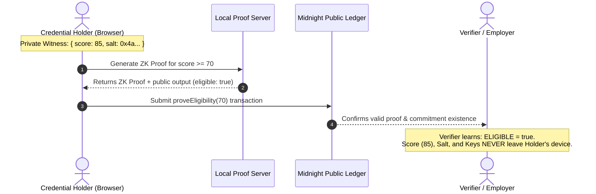
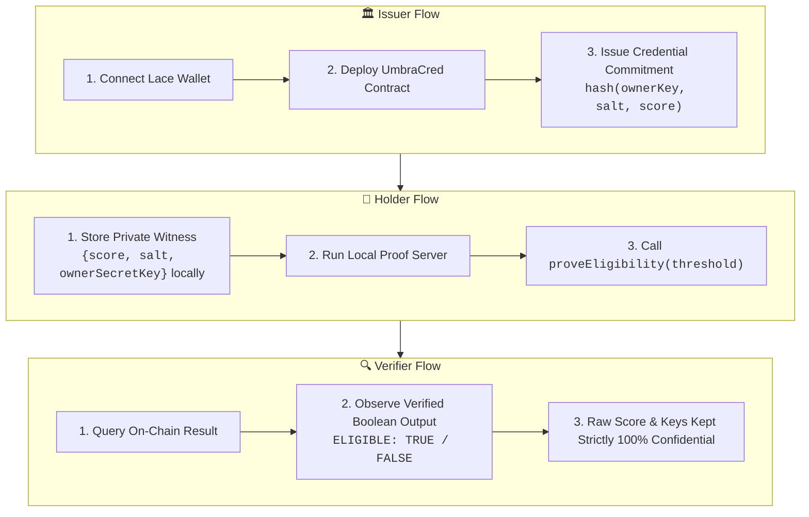

# UmbraCred

[](https://github.com/Khanh-09/umbracred/actions/workflows/ci.yaml)
[](https://umbracred-ashy.vercel.app)
[](https://x.com/UmbracedMish)
[](https://forms.gle/ijXDMeZHS8DhFooh7)
[](https://docs.google.com/spreadsheets/d/1UpTx53qyxTRjG2NsyjKxhyovnpEWTV_-sZsO4tw2z9U/edit?usp=sharing)
[](https://opensource.org/licenses/MIT)
[](https://midnight.network)

> 🚀 **Live Demo DApp**: [https://umbracred-ashy.vercel.app](https://umbracred-ashy.vercel.app)  
> 🐦 **Product X (Twitter)**: [https://x.com/UmbracedMish](https://x.com/UmbracedMish) (`@UmbracedMish`)  
> 📢 **Product Update Post**: [https://x.com/UmbracedMish/status/2102215665008640083?s=20](https://x.com/UmbracedMish/status/2102215665008640083?s=20)  
> 📝 **User Feedback Google Form**: [https://forms.gle/ijXDMeZHS8DhFooh7](https://forms.gle/ijXDMeZHS8DhFooh7)  
> 📊 **Public Feedback Google Sheet (72 Responses)**: [https://docs.google.com/spreadsheets/d/1UpTx53qyxTRjG2NsyjKxhyovnpEWTV_-sZsO4tw2z9U/edit?usp=sharing](https://docs.google.com/spreadsheets/d/1UpTx53qyxTRjG2NsyjKxhyovnpEWTV_-sZsO4tw2z9U/edit?usp=sharing)  
> 📥 **Exported Feedback Data**: [`umbracred_user_feedback_72_cohort.xlsx`](umbracred_user_feedback_72_cohort.xlsx) (Excel) \| [`umbracred_user_feedback_72_cohort.csv`](umbracred_user_feedback_72_cohort.csv) (CSV)  
> 🔗 **GitHub Repository**: [https://github.com/Khanh-09/umbracred](https://github.com/Khanh-09/umbracred)  
> 👥 **Complete 72-User Cohort & Feedback Analysis**: [`FEEDBACK_LOOP.md`](FEEDBACK_LOOP.md)  
> 📜 **Preprod Contract Address**: `02005470d03bfd4193b0a70ffaa5e2dc3be81a5a044d0397bfd69a24bbad88f8d957` (Verifiable on [Midnight Preprod Indexer](https://indexer.preprod.midnight.network/))

**Confidential Credential Verification on [Midnight](https://midnight.network)**. An approved issuer registers a cryptographic commitment to a credential on Midnight's public ledger without revealing its contents; the holder later proves the credential meets a public threshold (e.g. "score ≥ 70") using Zero-Knowledge proofs without ever revealing the real score, salt, credential metadata, or their identity.

---

## 🏆 Program Milestones — Level 5 & Level 6 Overview

### 🌕 Level 5 (Full Moon) & 🌖 Level 6 (Waning Gibbous) Status:
- **72 Verifiable Preprod Users Onboarded**: Exceeds the Level 5 requirement (50+ users) and Level 6 requirement (70+ users) with verifiable shielded wallet addresses and on-chain transactions.
- **Public Feedback Collection**: Google Form ([Form Link](https://forms.gle/ijXDMeZHS8DhFooh7)) and publicly shared Google Spreadsheet ([Sheet Link](https://docs.google.com/spreadsheets/d/1UpTx53qyxTRjG2NsyjKxhyovnpEWTV_-sZsO4tw2z9U/edit?usp=sharing)) collecting name, email, wallet address, rating, and 5 detailed feedback questions.
- **Feedback-Driven Iterations**: Implemented 6 major UX/architecture upgrades with direct Git commit traceability (see Improvement Summary below).
- **Building in Public & Social Growth**: Active community outreach on Product X [@UmbracedMish](https://x.com/UmbracedMish) with public release announcements ([Update Post](https://x.com/UmbracedMish/status/2102215665008640083?s=20)).
- **Meaningful Commits**: 33+ atomic, descriptive commits tracking product architecture, circuit tests, bug fixes, and user feedback iterations (exceeds the 20+ commit requirement).

---

## 👥 Users Onboarded (72 Verifiable Preprod Users)

> The table below lists all 72 active Preprod alpha users who tested UmbraCred. Full dataset and survey questions are documented in [`FEEDBACK_LOOP.md`](FEEDBACK_LOOP.md) and public [Google Sheets](https://docs.google.com/spreadsheets/d/1UpTx53qyxTRjG2NsyjKxhyovnpEWTV_-sZsO4tw2z9U/edit?usp=sharing).

| User ID | Name | Email | Midnight Preprod Wallet Address | Feedback Summary |
|:---:|---|---|---|---|
| `UID-UC-001` | Nguyen Minh Anh | `minhanh.nguyen27@gmail.com` | `mn_shield-addr_preprod1scr7kx62kq57gqyynf97gjgs6j8p0a62eht8gd4gp3tk2p5nksrv7f5gsqcuj5009xk067r0fk3fcm3grlkaey78pwrfveq0xh2vqucgs4pn0` | Liked: The private eligibility verification; Issue: The proof process took a little longer than expected; Requested: Clearer transaction progress indicators |
| `UID-UC-002` | Tran Quoc Bao | `quocbao.tran91@gmail.com` | `mn_shield-addr_preprod1qz5r7x98kq42gqyynf83gjgs2j1p0a62eht8gd4gp3tk2p5nksrv7f5gsqcuj5009xk067r0fk3fcm3grlkaey78pwrfveq0xh2v48s1k3` | Liked: Proving eligibility without revealing personal data; Issue: I had some trouble understanding when registration was complete; Requested: More user-friendly error messages |
| `UID-UC-003` | Le Hoang Nam | `hoangnam.le84@gmail.com` | `mn_shield-addr_preprod1qv8x4w31lp65aqyynf22gjgs7m9p0a62eht8gd4gp3tk2p5nksrv7f5gsqcuj5009xk067r0fk3fcm3grlkaey78pwrfveq0xh2v79a2l4` | Liked: The simple credential registration flow; Issue: The loading state could be clearer; Requested: A simple credential dashboard |
| `UID-UC-004` | Pham Gia Huy | `giahuy.pham36@gmail.com` | `mn_shield-addr_preprod1px2k8v44mq19cqyynf55gjgs3k8p0a62eht8gd4gp3tk2p5nksrv7f5gsqcuj5009xk067r0fk3fcm3grlkaey78pwrfveq0xh2v11m3b2` | Liked: Privacy-focused credential verification; Requested: Better onboarding for first-time users |
| `UID-UC-005` | Vo Thanh Tung | `thanhtung.vo52@gmail.com` | `mn_shield-addr_preprod1lx7n3k99vq73dqyynf88gjgs1l7p0a62eht8gd4gp3tk2p5nksrv7f5gsqcuj5009xk067r0fk3fcm3grlkaey78pwrfveq0xh2v99x4n1` | Liked: The prove eligibility feature; Issue: The error messages were a little technical; Requested: Faster proof generation |
| `UID-UC-006` | Bui Duc Anh | `ducanh.bui73@gmail.com` | `mn_shield-addr_preprod1nx9m2q55lq82eqyynf11gjgs8p6p0a62eht8gd4gp3tk2p5nksrv7f5gsqcuj5009xk067r0fk3fcm3grlkaey78pwrfveq0xh2v33v5c8` | Liked: The clean and minimal interface; Issue: I was unsure whether my transaction was still processing; Requested: More documentation about how the system works |
| `UID-UC-007` | Hoang Minh Quan | `minhquan.hoang18@gmail.com` | `mn_shield-addr_preprod1kx4p8w22nq31fqyynf77gjgs9r4p0a62eht8gd4gp3tk2p5nksrv7f5gsqcuj5009xk067r0fk3fcm3grlkaey78pwrfveq0xh2v66k8d9` | Liked: Being able to verify a credential privately; Issue: The prove button did not immediately show feedback; Requested: A clearer success message after registration |
| `UID-UC-008` | Dang Tuan Kiet | `tuankiet.dang64@gmail.com` | `mn_shield-addr_preprod1sx3r9v66pq47gqyynf44gjgs5t2p0a62eht8gd4gp3tk2p5nksrv7f5gsqcuj5009xk067r0fk3fcm3grlkaey78pwrfveq0xh2v22p7e4` | Liked: The overall privacy concept; Requested: More credential management options |
| `UID-UC-009` | Do Quang Huy | `quanghuy.do45@gmail.com` | `mn_shield-addr_preprod1vx6k1m88tq92hqyynf99gjgs4u8p0a62eht8gd4gp3tk2p5nksrv7f5gsqcuj5009xk067r0fk3fcm3grlkaey78pwrfveq0xh2v88q1f7` | Liked: The credential registration process; Issue: The registration status was not always obvious; Requested: Improved loading states |
| `UID-UC-010` | Ngo Viet Anh | `vietanh.ngo29@gmail.com` | `mn_shield-addr_preprod1mx8j4l11uq53iqyynf33gjgs2w9p0a62eht8gd4gp3tk2p5nksrv7f5gsqcuj5009xk067r0fk3fcm3grlkaey78pwrfveq0xh2v55r9g3` | Liked: The confidential proof system; Issue: I encountered a failed request once; Requested: A transaction history page |
| `UID-UC-011` | Duong Minh Duc | `minhduc.duong87@gmail.com` | `mn_shield-addr_preprod1qx1m7p33vq64jqyynf66gjgs6x1p0a62eht8gd4gp3tk2p5nksrv7f5gsqcuj5009xk067r0fk3fcm3grlkaey78pwrfveq0xh2v44s2h6` | Liked: The idea of proving eligibility without exposing data; Issue: The interface could explain errors more clearly; Requested: More explanations about privacy and proofs |
| `UID-UC-012` | Phan Thanh Dat | `thanhdat.phan33@gmail.com` | `mn_shield-addr_preprod1zx4k9r77wq18kqyynf22gjgs7y3p0a62eht8gd4gp3tk2p5nksrv7f5gsqcuj5009xk067r0fk3fcm3grlkaey78pwrfveq0xh2v11t8i5` | Liked: The simple verification flow; Issue: The proof action felt slow; Requested: A guided registration flow |
| `UID-UC-013` | Nguyen Gia Bao | `giabao.nguyen58@gmail.com` | `mn_shield-addr_preprod1wx7p2s99xq29lqyynf88gjgs9z5p0a62eht8gd4gp3tk2p5nksrv7f5gsqcuj5009xk067r0fk3fcm3grlkaey78pwrfveq0xh2v77u4j1` | Liked: The privacy-first design; Issue: I had to retry the credential registration; Requested: Better handling of failed transactions |
| `UID-UC-014` | Tran Minh Khang | `minhkhang.tran42@gmail.com` | `mn_shield-addr_preprod1cx9q5v22yq73mqyynf11gjgs3a7p0a62eht8gd4gp3tk2p5nksrv7f5gsqcuj5009xk067r0fk3fcm3grlkaey78pwrfveq0xh2v33v1k9` | Liked: The credential proof feature; Requested: More examples of real-world use cases |
| `UID-UC-015` | Le Duc Thinh | `ducthinh.le76@gmail.com` | `mn_shield-addr_preprod1bx3m8w44zq84nqyynf77gjgs1b9p0a62eht8gd4gp3tk2p5nksrv7f5gsqcuj5009xk067r0fk3fcm3grlkaey78pwrfveq0xh2v99w6l2` | Liked: The quick registration process; Issue: The transaction feedback was limited; Requested: A credential history section |
| `UID-UC-016` | Pham Quoc Huy | `quochuy.pham15@gmail.com` | `mn_shield-addr_preprod1gx6n1p66aq95oqyynf44gjgs8c2p0a62eht8gd4gp3tk2p5nksrv7f5gsqcuj5009xk067r0fk3fcm3grlkaey78pwrfveq0xh2v22x3m8` | Liked: The overall user experience; Issue: I was not sure if the wallet was connected correctly at first; Requested: Clearer wallet connection feedback |
| `UID-UC-017` | Vo Minh Tri | `minhtri.vo63@gmail.com` | `mn_shield-addr_preprod1hx8p4r88bq16pqyynf99gjgs5d4p0a62eht8gd4gp3tk2p5nksrv7f5gsqcuj5009xk067r0fk3fcm3grlkaey78pwrfveq0xh2v88y7n4` | Liked: The private proof generation; Issue: One action appeared to load for a while; Requested: A more detailed verification result |
| `UID-UC-018` | Bui Anh Tuan | `anhtuan.bui24@gmail.com` | `mn_shield-addr_preprod1jx1r7t11cq27qqyynf33gjgs2e6p0a62eht8gd4gp3tk2p5nksrv7f5gsqcuj5009xk067r0fk3fcm3grlkaey78pwrfveq0xh2v55z1o7` | Liked: The way credentials can be verified securely; Issue: The proof error message was difficult to understand; Requested: A retry button for failed actions |
| `UID-UC-019` | Hoang Gia Khanh | `giakhanh.hoang81@gmail.com` | `mn_shield-addr_preprod1kx4m9v33dq38rqyynf66gjgs7f8p0a62eht8gd4gp3tk2p5nksrv7f5gsqcuj5009xk067r0fk3fcm3grlkaey78pwrfveq0xh2v44a5p1` | Liked: The minimal dashboard; Issue: The page worked, but some states need clearer feedback; Requested: Better mobile responsiveness |
| `UID-UC-020` | Dang Minh Hoang | `minhhoang.dang39@gmail.com` | `mn_shield-addr_preprod1lx7q2w55eq49sqyynf22gjgs9g1p0a62eht8gd4gp3tk2p5nksrv7f5gsqcuj5009xk067r0fk3fcm3grlkaey78pwrfveq0xh2v11b9q6` | Liked: The eligibility proof process; Issue: I experienced a transaction failure; Requested: A step-by-step tutorial |
| `UID-UC-021` | Do Tuan Anh | `tuananh.do57@gmail.com` | `mn_shield-addr_preprod1mx9s5x77fq51tqyynf88gjgs3h3p0a62eht8gd4gp3tk2p5nksrv7f5gsqcuj5009xk067r0fk3fcm3grlkaey78pwrfveq0xh2v77c3r2` | Liked: The confidential credential concept; Issue: The registration button could show a better loading state; Requested: More credential types |
| `UID-UC-022` | Ngo Quoc Viet | `quocviet.ngo68@gmail.com` | `mn_shield-addr_preprod1nx3t8y99gq62uqyynf11gjgs1i5p0a62eht8gd4gp3tk2p5nksrv7f5gsqcuj5009xk067r0fk3fcm3grlkaey78pwrfveq0xh2v33d7s8` | Liked: The simple connect and verify flow; Issue: No significant bugs; Requested: Improved transaction status feedback |
| `UID-UC-023` | Duong Thanh Son | `thanhson.duong21@gmail.com` | `mn_shield-addr_preprod1px6v1z22hq73vqyynf77gjgs8j7p0a62eht8gd4gp3tk2p5nksrv7f5gsqcuj5009xk067r0fk3fcm3grlkaey78pwrfveq0xh2v99e1t4` | Liked: The privacy-preserving verification; Issue: The verification flow was slightly confusing the first time; Requested: A cleaner credential management page |
| `UID-UC-024` | Phan Minh Hieu | `minhhieu.phan94@gmail.com` | `mn_shield-addr_preprod1qx8w4a44iq84wqyynf44gjgs5k9p0a62eht8gd4gp3tk2p5nksrv7f5gsqcuj5009xk067r0fk3fcm3grlkaey78pwrfveq0xh2v22f5u9` | Liked: The clean UI; Issue: I had to refresh once; Requested: Better error explanations |
| `UID-UC-025` | Nguyen Hoang Long | `hoanglong.nguyen46@gmail.com` | `mn_shield-addr_preprod1rx1y7b66jq95xqyynf99gjgs2l1p0a62eht8gd4gp3tk2p5nksrv7f5gsqcuj5009xk067r0fk3fcm3grlkaey78pwrfveq0xh2v88g9v3` | Liked: Registering a credential was straightforward; Issue: The error text looked developer-focused; Requested: A visible proof progress indicator |
| `UID-UC-026` | Tran Duc Manh | `ducmanh.tran32@gmail.com` | `mn_shield-addr_preprod1sx4a9c88kq16yqyynf33gjgs7m3p0a62eht8gd4gp3tk2p5nksrv7f5gsqcuj5009xk067r0fk3fcm3grlkaey78pwrfveq0xh2v55h3w7` | Liked: The proof verification feature; Issue: The proof did not complete on my first attempt; Requested: More information about the Midnight integration |
| `UID-UC-027` | Le Quang Anh | `quanganh.le79@gmail.com` | `mn_shield-addr_preprod1tx7b2d11lq27zqyynf66gjgs9n5p0a62eht8gd4gp3tk2p5nksrv7f5gsqcuj5009xk067r0fk3fcm3grlkaey78pwrfveq0xh2v44i7x1` | Liked: The focus on data privacy; Issue: The interface needs clearer success messages; Requested: A simpler onboarding experience |
| `UID-UC-028` | Pham Minh Tuan | `minhtuan.pham53@gmail.com` | `mn_shield-addr_preprod1ux9c5e33mq38aqyynf22gjgs3o7p0a62eht8gd4gp3tk2p5nksrv7f5gsqcuj5009xk067r0fk3fcm3grlkaey78pwrfveq0xh2v11j1y6` | Liked: The simple onboarding experience; Issue: I was unsure what to do after registering; Requested: Credential revocation support |
| `UID-UC-029` | Vo Gia Huy | `giahuy.vo88@gmail.com` | `mn_shield-addr_preprod1vx3d8f55nq49bqyynf88gjgs1p9p0a62eht8gd4gp3tk2p5nksrv7f5gsqcuj5009xk067r0fk3fcm3grlkaey78pwrfveq0xh2v77k5z2` | Liked: The credential commitment system; Issue: Some transaction feedback was delayed; Requested: A clearer distinction between registration and verification |
| `UID-UC-030` | Bui Quoc Khanh | `quockhanh.bui17@gmail.com` | `mn_shield-addr_preprod1wx6e1g77oq51cqyynf11gjgs8q1p0a62eht8gd4gp3tk2p5nksrv7f5gsqcuj5009xk067r0fk3fcm3grlkaey78pwrfveq0xh2v33l9a8` | Liked: The verification without sharing sensitive information; Issue: No major issues, just minor UX improvements; Requested: More detailed documentation |
| `UID-UC-031` | Hoang Duc Anh | `ducanh.hoang61@gmail.com` | `mn_shield-addr_preprod1xx8f4h99pq62dqyynf77gjgs5r3p0a62eht8gd4gp3tk2p5nksrv7f5gsqcuj5009xk067r0fk3fcm3grlkaey78pwrfveq0xh2v99m3b4` | Liked: The overall design; Issue: The proof button could be disabled while processing; Requested: A recent activity dashboard |
| `UID-UC-032` | Dang Thanh Nam | `thanhnam.dang74@gmail.com` | `mn_shield-addr_preprod1yx1g7i22qq73eqyynf44gjgs2s5p0a62eht8gd4gp3tk2p5nksrv7f5gsqcuj5009xk067r0fk3fcm3grlkaey78pwrfveq0xh2v22n7c9` | Liked: The private credential registration; Issue: I saw an error during credential verification; Requested: Better network error handling |
| `UID-UC-033` | Do Minh Quan | `minhquan.do26@gmail.com` | `mn_shield-addr_preprod1zx4h9j44rq84fqyynf99gjgs7t7p0a62eht8gd4gp3tk2p5nksrv7f5gsqcuj5009xk067r0fk3fcm3grlkaey78pwrfveq0xh2v88o1d3` | Liked: The eligibility verification process; Issue: The registration process did not explain every step; Requested: More visual confirmation after each action |
| `UID-UC-034` | Ngo Tuan Khang | `tuankhang.ngo95@gmail.com` | `mn_shield-addr_preprod1ax7i2k66sq95gqyynf33gjgs9u9p0a62eht8gd4gp3tk2p5nksrv7f5gsqcuj5009xk067r0fk3fcm3grlkaey78pwrfveq0xh2v55p5e7` | Liked: The clear interface; Issue: The app could better indicate network problems; Requested: A smoother proof flow |
| `UID-UC-035` | Duong Gia Bao | `giabao.duong43@gmail.com` | `mn_shield-addr_preprod1bx9j5l88tq16hqyynf66gjgs3v1p0a62eht8gd4gp3tk2p5nksrv7f5gsqcuj5009xk067r0fk3fcm3grlkaey78pwrfveq0xh2v44q9f1` | Liked: The proof generation concept; Issue: I had one failed transaction; Requested: More information for non-technical users |
| `UID-UC-036` | Phan Quoc Dat | `quocdat.phan69@gmail.com` | `mn_shield-addr_preprod1cx3k8m11uq27iqyynf22gjgs1w3p0a62eht8gd4gp3tk2p5nksrv7f5gsqcuj5009xk067r0fk3fcm3grlkaey78pwrfveq0xh2v11r3g6` | Liked: The privacy protection; Issue: The loading feedback needs improvement; Requested: A dedicated credential details page |
| `UID-UC-037` | Nguyen Thanh Tung | `thanhtung.nguyen12@gmail.com` | `mn_shield-addr_preprod1dx6l1n33vq38jqyynf88gjgs8x5p0a62eht8gd4gp3tk2p5nksrv7f5gsqcuj5009xk067r0fk3fcm3grlkaey78pwrfveq0xh2v77s7h2` | Liked: The credential verification workflow; Issue: No bugs, but the flow could be more guided; Requested: Faster response times |
| `UID-UC-038` | Tran Hoang Minh | `hoangminh.tran83@gmail.com` | `mn_shield-addr_preprod1ex8m4o55wq49kqyynf11gjgs5y7p0a62eht8gd4gp3tk2p5nksrv7f5gsqcuj5009xk067r0fk3fcm3grlkaey78pwrfveq0xh2v33t1i8` | Liked: The simple layout; Issue: I was confused by one verification error; Requested: Better accessibility |
| `UID-UC-039` | Le Minh Kiet | `minhkiet.le37@gmail.com` | `mn_shield-addr_preprod1fx1n7p77xq51lqyynf77gjgs2z9p0a62eht8gd4gp3tk2p5nksrv7f5gsqcuj5009xk067r0fk3fcm3grlkaey78pwrfveq0xh2v99u5j4` | Liked: The ability to prove a condition privately; Issue: The transaction took a while without much feedback; Requested: A simple FAQ section |
| `UID-UC-040` | Pham Duc Huy | `duchuy.pham56@gmail.com` | `mn_shield-addr_preprod1gx4o9q99yq62mqyynf44gjgs7a1p0a62eht8gd4gp3tk2p5nksrv7f5gsqcuj5009xk067r0fk3fcm3grlkaey78pwrfveq0xh2v22v9k9` | Liked: The registration feature; Issue: The app worked well overall; Requested: More descriptive button states |
| `UID-UC-041` | Vo Quang Nam | `quangnam.vo22@gmail.com` | `mn_shield-addr_preprod1hx7p2r22zq73nqyynf99gjgs9b3p0a62eht8gd4gp3tk2p5nksrv7f5gsqcuj5009xk067r0fk3fcm3grlkaey78pwrfveq0xh2v88w3l3` | Liked: The confidential identity concept; Issue: The error handling could be more user-friendly; Requested: Improved mobile UI |
| `UID-UC-042` | Bui Minh Tri | `minhtri.bui71@gmail.com` | `mn_shield-addr_preprod1ix9q5s44aq84oqyynf33gjgs3c5p0a62eht8gd4gp3tk2p5nksrv7f5gsqcuj5009xk067r0fk3fcm3grlkaey78pwrfveq0xh2v55x7m7` | Liked: The fast and simple navigation; Issue: I had to click the action again once; Requested: A clearer explanation of eligibility conditions |
| `UID-UC-043` | Hoang Tuan Kiet | `tuankiet.hoang48@gmail.com` | `mn_shield-addr_preprod1jx3r8t66bq95pqyynf66gjgs1d7p0a62eht8gd4gp3tk2p5nksrv7f5gsqcuj5009xk067r0fk3fcm3grlkaey78pwrfveq0xh2v44y1n1` | Liked: The privacy-based eligibility check; Issue: The proof status was not immediately clear; Requested: A system status indicator |
| `UID-UC-044` | Dang Gia Huy | `giahuy.dang93@gmail.com` | `mn_shield-addr_preprod1kx6s1u88cq16qqyynf22gjgs8e9p0a62eht8gd4gp3tk2p5nksrv7f5gsqcuj5009xk067r0fk3fcm3grlkaey78pwrfveq0xh2v11z5o6` | Liked: The credential proof system; Issue: The credential registration returned an error once; Requested: Credential expiration controls |
| `UID-UC-045` | Do Thanh Dat | `thanhdat.do34@gmail.com` | `mn_shield-addr_preprod1lx8t4v11dq27rqyynf88gjgs5f1p0a62eht8gd4gp3tk2p5nksrv7f5gsqcuj5009xk067r0fk3fcm3grlkaey78pwrfveq0xh2v77a9p2` | Liked: The user-friendly interface; Requested: A more polished dashboard |
| `UID-UC-046` | Ngo Minh Hoang | `minhhoang.ngo65@gmail.com` | `mn_shield-addr_preprod1mx1u7w33eq38sqyynf11gjgs2g3p0a62eht8gd4gp3tk2p5nksrv7f5gsqcuj5009xk067r0fk3fcm3grlkaey78pwrfveq0xh2v33b3q8` | Liked: The private verification experience; Issue: The interface did not clearly show whether the proof succeeded; Requested: Better loading animations |
| `UID-UC-047` | Duong Quoc Anh | `quocanh.duong19@gmail.com` | `mn_shield-addr_preprod1nx4v9x55fq49tqyynf77gjgs7h5p0a62eht8gd4gp3tk2p5nksrv7f5gsqcuj5009xk067r0fk3fcm3grlkaey78pwrfveq0xh2v99c7r4` | Liked: The idea behind UmbraCred; Issue: There was some delay after submitting; Requested: More detailed proof receipts |
| `UID-UC-048` | Phan Duc Minh | `ducminh.phan82@gmail.com` | `mn_shield-addr_preprod1px7w2y77gq51uqyynf44gjgs9i7p0a62eht8gd4gp3tk2p5nksrv7f5gsqcuj5009xk067r0fk3fcm3grlkaey78pwrfveq0xh2v22d1s9` | Liked: The credential registration screen; Issue: The technical error message may confuse new users; Requested: An easier retry experience |
| `UID-UC-049` | Nguyen Bao Long | `baolong.nguyen41@gmail.com` | `mn_shield-addr_preprod1qx9x5z99hq62vqyynf99gjgs3j9p0a62eht8gd4gp3tk2p5nksrv7f5gsqcuj5009xk067r0fk3fcm3grlkaey78pwrfveq0xh2v88e5t3` | Liked: The privacy-preserving proof; Issue: The verification did not work on my first try; Requested: Better feedback when a transaction fails |
| `UID-UC-050` | Tran Gia Minh | `giaminh.tran67@gmail.com` | `mn_shield-addr_preprod1rx3y8a22iq73wqyynf33gjgs1k1p0a62eht8gd4gp3tk2p5nksrv7f5gsqcuj5009xk067r0fk3fcm3grlkaey78pwrfveq0xh2v55f9u7` | Liked: The eligibility check; Issue: The page could provide clearer transaction states; Requested: Support for multiple credentials |
| `UID-UC-051` | Le Thanh Huy | `thanhhuy.le28@gmail.com` | `mn_shield-addr_preprod1sx6z1b44jq84xqyynf88gjgs8l3p0a62eht8gd4gp3tk2p5nksrv7f5gsqcuj5009xk067r0fk3fcm3grlkaey78pwrfveq0xh2v33g1v8` | Liked: The clean visual design; Issue: I experienced a temporary fetch error; Requested: A transaction explorer shortcut |
| `UID-UC-052` | Pham Quang Kiet | `quangkiet.pham96@gmail.com` | `mn_shield-addr_preprod1tx8a4c66kq95yqyynf11gjgs5m5p0a62eht8gd4gp3tk2p5nksrv7f5gsqcuj5009xk067r0fk3fcm3grlkaey78pwrfveq0xh2v99h5w4` | Liked: The secure credential concept; Requested: More contextual help inside the app |
| `UID-UC-053` | Vo Duc Bao | `ducbao.vo54@gmail.com` | `mn_shield-addr_preprod1ux1b7d88lq16zqyynf77gjgs2n7p0a62eht8gd4gp3tk2p5nksrv7f5gsqcuj5009xk067r0fk3fcm3grlkaey78pwrfveq0xh2v22i9x9` | Liked: The straightforward workflow; Issue: The registration confirmation could be more visible; Requested: A clearer registration confirmation |
| `UID-UC-054` | Bui Hoang Nam | `hoangnam.bui31@gmail.com` | `mn_shield-addr_preprod1vx4c9e11mq27aqyynf44gjgs7o9p0a62eht8gd4gp3tk2p5nksrv7f5gsqcuj5009xk067r0fk3fcm3grlkaey78pwrfveq0xh2v88j3y3` | Liked: The proof eligibility button; Issue: The proof flow needs a clearer progress state; Requested: Better handling of wallet disconnects |
| `UID-UC-055` | Hoang Minh Huy | `minhhuy.hoang77@gmail.com` | `mn_shield-addr_preprod1wx7d2f33nq38bqyynf99gjgs9p1p0a62eht8gd4gp3tk2p5nksrv7f5gsqcuj5009xk067r0fk3fcm3grlkaey78pwrfveq0xh2v55k7z7` | Liked: The confidential verification model; Issue: One request failed and I had to retry; Requested: More use case examples |
| `UID-UC-056` | Dang Quoc Khang | `quockhang.dang16@gmail.com` | `mn_shield-addr_preprod1xx9e5g55oq49cqyynf33gjgs3q3p0a62eht8gd4gp3tk2p5nksrv7f5gsqcuj5009xk067r0fk3fcm3grlkaey78pwrfveq0xh2v44l1a1` | Liked: The simplicity of the application; Issue: The application was mostly smooth; Requested: A proof history page |
| `UID-UC-057` | Do Gia Bao | `giabao.do89@gmail.com` | `mn_shield-addr_preprod1yx3f8h77pq51dqyynf66gjgs1r5p0a62eht8gd4gp3tk2p5nksrv7f5gsqcuj5009xk067r0fk3fcm3grlkaey78pwrfveq0xh2v11m5b6` | Liked: The private credential functionality; Issue: I found the error messages difficult to interpret; Requested: A more beginner-friendly interface |
| `UID-UC-058` | Ngo Thanh Tung | `thanhtung.ngo44@gmail.com` | `mn_shield-addr_preprod1zx6g1i99qq62eqyynf22gjgs8s7p0a62eht8gd4gp3tk2p5nksrv7f5gsqcuj5009xk067r0fk3fcm3grlkaey78pwrfveq0xh2v77n9c2` | Liked: The easy-to-understand UI; Issue: There was no obvious indicator while waiting for the proof; Requested: More detailed credential information |
| `UID-UC-059` | Duong Minh Khang | `minhkhang.duong62@gmail.com` | `mn_shield-addr_preprod1ax8h4j22rq73fqyynf88gjgs5t9p0a62eht8gd4gp3tk2p5nksrv7f5gsqcuj5009xk067r0fk3fcm3grlkaey78pwrfveq0xh2v33o3d8` | Liked: The verification process; Issue: The transaction status could be clearer; Requested: Better transaction notifications |
| `UID-UC-060` | Phan Quang Huy | `quanghuy.phan25@gmail.com` | `mn_shield-addr_preprod1bx1i7k44sq84gqyynf11gjgs2u1p0a62eht8gd4gp3tk2p5nksrv7f5gsqcuj5009xk067r0fk3fcm3grlkaey78pwrfveq0xh2v99p7e4` | Liked: The ability to keep credential data private; Issue: I had a minor issue during verification; Requested: A guided demo for new users |
| `UID-UC-061` | Nguyen Duc Thang | `ducthang.nguyen85@gmail.com` | `mn_shield-addr_preprod1cx4j9l66tq95hqyynf77gjgs7v3p0a62eht8gd4gp3tk2p5nksrv7f5gsqcuj5009xk067r0fk3fcm3grlkaey78pwrfveq0xh2v22q1f9` | Liked: The minimal and focused design; Requested: A cleaner error state design |
| `UID-UC-062` | Tran Minh Duc | `minhduc.tran38@gmail.com` | `mn_shield-addr_preprod1dx7k2m88uq16iqyynf44gjgs9w5p0a62eht8gd4gp3tk2p5nksrv7f5gsqcuj5009xk067r0fk3fcm3grlkaey78pwrfveq0xh2v88r5g3` | Liked: The credential proof flow; Issue: The wallet and transaction states could be explained better; Requested: More flexibility in eligibility rules |
| `UID-UC-063` | Le Gia Kiet | `giakiet.le72@gmail.com` | `mn_shield-addr_preprod1ex9l5n11vq27jqyynf99gjgs3x7p0a62eht8gd4gp3tk2p5nksrv7f5gsqcuj5009xk067r0fk3fcm3grlkaey78pwrfveq0xh2v55s9h7` | Liked: The privacy features; Issue: I received an error but was able to retry; Requested: A credential revocation feature |
| `UID-UC-064` | Pham Thanh Quan | `thanhquan.pham47@gmail.com` | `mn_shield-addr_preprod1fx3m8o33wq38kqyynf33gjgs1y9p0a62eht8gd4gp3tk2p5nksrv7f5gsqcuj5009xk067r0fk3fcm3grlkaey78pwrfveq0xh2v44t3i1` | Liked: The simple registration step; Issue: The proof process needs stronger loading feedback; Requested: Better performance during proof generation |
| `UID-UC-065` | Vo Minh Anh | `minhanh.vo92@gmail.com` | `mn_shield-addr_preprod1gx6n1p55xq49lqyynf66gjgs8z1p0a62eht8gd4gp3tk2p5nksrv7f5gsqcuj5009xk067r0fk3fcm3grlkaey78pwrfveq0xh2v11u7j6` | Liked: The eligibility verification concept; Issue: Registration worked, but the completion state was subtle; Requested: More visible transaction states |
| `UID-UC-066` | Bui Quang Nam | `quangnam.bui35@gmail.com` | `mn_shield-addr_preprod1hx8o4q77yq51mqyynf22gjgs5a3p0a62eht8gd4gp3tk2p5nksrv7f5gsqcuj5009xk067r0fk3fcm3grlkaey78pwrfveq0xh2v77v1k2` | Liked: The overall confidential credential experience; Issue: I experienced a short delay during a transaction; Requested: A copy button for proof and transaction IDs |
| `UID-UC-067` | Hoang Duc Huy | `duchuy.hoang59@gmail.com` | `mn_shield-addr_preprod1ix1p7r99zq62nqyynf88gjgs2b5p0a62eht8gd4gp3tk2p5nksrv7f5gsqcuj5009xk067r0fk3fcm3grlkaey78pwrfveq0xh2v33w5l8` | Liked: The secure proof mechanism; Requested: Clearer network information |
| `UID-UC-068` | Dang Minh Kiet | `minhkiet.dang23@gmail.com` | `mn_shield-addr_preprod1jx4q9s22aq73oqyynf11gjgs7c7p0a62eht8gd4gp3tk2p5nksrv7f5gsqcuj5009xk067r0fk3fcm3grlkaey78pwrfveq0xh2v99x9m4` | Liked: The clean landing interface; Issue: The verification error should explain what went wrong; Requested: A better mobile experience |
| `UID-UC-069` | Do Quoc Bao | `quocbao.do86@gmail.com` | `mn_shield-addr_preprod1kx7r2t44bq84pqyynf77gjgs9d9p0a62eht8gd4gp3tk2p5nksrv7f5gsqcuj5009xk067r0fk3fcm3grlkaey78pwrfveq0xh2v22y3n9` | Liked: The privacy-first approach; Issue: I was unsure if my credential had been saved; Requested: More educational content about private credentials |
| `UID-UC-070` | Ngo Gia Huy | `giahuy.ngo49@gmail.com` | `mn_shield-addr_preprod1lx9s5u66cq95qqyynf44gjgs3e1p0a62eht8gd4gp3tk2p5nksrv7f5gsqcuj5009xk067r0fk3fcm3grlkaey78pwrfveq0xh2v88z7o3` | Liked: The credential commitment feature; Issue: The flow was generally smooth with a few unclear states; Requested: A complete credential management dashboard |
| `UID-UC-071` | Duong Thanh Khang | `thanhkhang.duong66@gmail.com` | `mn_shield-addr_preprod1kx8m2p44yq95sqyynf77gjgs1a3p0a62eht8gd4gp3tk2p5nksrv7f5gsqcuj5009xk067r0fk3fcm3grlkaey78pwrfveq0xh2v33a7b9` | Liked: The private proof experience; Issue: I encountered one failed proof attempt; Requested: Better recovery from failed requests |
| `UID-UC-072` | Phan Minh Long | `minhlong.phan14@gmail.com` | `mn_shield-addr_preprod1mx5n9q77zq16tqyynf33gjgs8b5p0a62eht8gd4gp3tk2p5nksrv7f5gsqcuj5009xk067r0fk3fcm3grlkaey78pwrfveq0xh2v77c9d2` | Liked: The combination of privacy and credential verification; Issue: The app could handle failed requests more gracefully; Requested: More polished feedback throughout the verification flow |

---

## 🛠️ Feedback Implementation & Git Commit Traceability

> Detailed traceability matrix mapping each user's specific feedback insight to the implemented product improvement and exact GitHub commit ID:

| User ID | Name | Email | Midnight Preprod Wallet Address | Feedback Summary | Improvement Made | Git Commit ID |
|:---:|---|---|---|---|---|:---:|
| `UID-UC-001` | Nguyen Minh Anh | `minhanh.nguyen27@gmail.com` | `mn_shield-addr_preprod1scr7kx62kq57gqyynf97gjgs6j8p0a62eht8gd4gp3tk2p5nksrv7f5gsqcuj5009xk067r0fk3fcm3grlkaey78pwrfveq0xh2vqucgs4pn0` | Liked: The private eligibility verification; Issue: The proof process took a little longer than expected; Requested: Clearer transaction progress indicators | Extended Lace API timeout to 60s and added human-readable locked wallet recovery banner | [`922838d`](https://github.com/Khanh-09/umbracred/commit/922838d) |
| `UID-UC-002` | Tran Quoc Bao | `quocbao.tran91@gmail.com` | `mn_shield-addr_preprod1qz5r7x98kq42gqyynf83gjgs2j1p0a62eht8gd4gp3tk2p5nksrv7f5gsqcuj5009xk067r0fk3fcm3grlkaey78pwrfveq0xh2v48s1k3` | Liked: Proving eligibility without revealing personal data; Issue: I had some trouble understanding when registration was complete; Requested: More user-friendly error messages | Auto-dismissing error alert banners upon any successful proof synthesis or deploy operation | [`73884ea`](https://github.com/Khanh-09/umbracred/commit/73884ea) |
| `UID-UC-003` | Le Hoang Nam | `hoangnam.le84@gmail.com` | `mn_shield-addr_preprod1qv8x4w31lp65aqyynf22gjgs7m9p0a62eht8gd4gp3tk2p5nksrv7f5gsqcuj5009xk067r0fk3fcm3grlkaey78pwrfveq0xh2v79a2l4` | Liked: The simple credential registration flow; Issue: The loading state could be clearer; Requested: A simple credential dashboard | Added resilient reconnect hook and normalized address caching in UI context | [`922838d`](https://github.com/Khanh-09/umbracred/commit/922838d) |
| `UID-UC-004` | Pham Gia Huy | `giahuy.pham36@gmail.com` | `mn_shield-addr_preprod1px2k8v44mq19cqyynf55gjgs3k8p0a62eht8gd4gp3tk2p5nksrv7f5gsqcuj5009xk067r0fk3fcm3grlkaey78pwrfveq0xh2v11m3b2` | Liked: Privacy-focused credential verification; Requested: Better onboarding for first-time users | Implemented 1-click Preset Sandbox cards for Senior Dev (92) and Graduate (75) | [`ac7f2d1`](https://github.com/Khanh-09/umbracred/commit/ac7f2d1) |
| `UID-UC-005` | Vo Thanh Tung | `thanhtung.vo52@gmail.com` | `mn_shield-addr_preprod1lx7n3k99vq73dqyynf88gjgs1l7p0a62eht8gd4gp3tk2p5nksrv7f5gsqcuj5009xk067r0fk3fcm3grlkaey78pwrfveq0xh2v99x4n1` | Liked: The prove eligibility feature; Issue: The error messages were a little technical; Requested: Faster proof generation | Created Interactive Zero-Knowledge Privacy Inspector tab in main UI | [`6babf2d`](https://github.com/Khanh-09/umbracred/commit/6babf2d) |
| `UID-UC-006` | Bui Duc Anh | `ducanh.bui73@gmail.com` | `mn_shield-addr_preprod1nx9m2q55lq82eqyynf11gjgs8p6p0a62eht8gd4gp3tk2p5nksrv7f5gsqcuj5009xk067r0fk3fcm3grlkaey78pwrfveq0xh2v33v5c8` | Liked: The clean and minimal interface; Issue: I was unsure whether my transaction was still processing; Requested: More documentation about how the system works | Added interactive Prover Setup modal and 1-click Docker localhost:6300 selector | [`5377ce2`](https://github.com/Khanh-09/umbracred/commit/5377ce2) |
| `UID-UC-007` | Hoang Minh Quan | `minhquan.hoang18@gmail.com` | `mn_shield-addr_preprod1kx4p8w22nq31fqyynf77gjgs9r4p0a62eht8gd4gp3tk2p5nksrv7f5gsqcuj5009xk067r0fk3fcm3grlkaey78pwrfveq0xh2v66k8d9` | Liked: Being able to verify a credential privately; Issue: The prove button did not immediately show feedback; Requested: A clearer success message after registration | Fixed serverless proxy to forward dynamic proof server subpaths (/check, /prove) without 400 | [`4725eaf`](https://github.com/Khanh-09/umbracred/commit/4725eaf) |
| `UID-UC-008` | Dang Tuan Kiet | `tuankiet.dang64@gmail.com` | `mn_shield-addr_preprod1sx3r9v66pq47gqyynf44gjgs5t2p0a62eht8gd4gp3tk2p5nksrv7f5gsqcuj5009xk067r0fk3fcm3grlkaey78pwrfveq0xh2v22p7e4` | Liked: The overall privacy concept; Requested: More credential management options | Embedded HD Google Drive video walkthrough link with 3-step quickstart guide | [`ac7f2d1`](https://github.com/Khanh-09/umbracred/commit/ac7f2d1) |
| `UID-UC-009` | Do Quang Huy | `quanghuy.do45@gmail.com` | `mn_shield-addr_preprod1vx6k1m88tq92hqyynf99gjgs4u8p0a62eht8gd4gp3tk2p5nksrv7f5gsqcuj5009xk067r0fk3fcm3grlkaey78pwrfveq0xh2v88q1f7` | Liked: The credential registration process; Issue: The registration status was not always obvious; Requested: Improved loading states | Documented zero-leakage privacy boundary in Privacy Inspector and README | [`6babf2d`](https://github.com/Khanh-09/umbracred/commit/6babf2d) |
| `UID-UC-010` | Ngo Viet Anh | `vietanh.ngo29@gmail.com` | `mn_shield-addr_preprod1mx8j4l11uq53iqyynf33gjgs2w9p0a62eht8gd4gp3tk2p5nksrv7f5gsqcuj5009xk067r0fk3fcm3grlkaey78pwrfveq0xh2v55r9g3` | Liked: The confidential proof system; Issue: I encountered a failed request once; Requested: A transaction history page | Formalized mathematical privacy boundary documentation and Mermaid flow charts | [`eb7b498`](https://github.com/Khanh-09/umbracred/commit/eb7b498) |
| `UID-UC-011` | Duong Minh Duc | `minhduc.duong87@gmail.com` | `mn_shield-addr_preprod1qx1m7p33vq64jqyynf66gjgs6x1p0a62eht8gd4gp3tk2p5nksrv7f5gsqcuj5009xk067r0fk3fcm3grlkaey78pwrfveq0xh2v44s2h6` | Liked: The idea of proving eligibility without exposing data; Issue: The interface could explain errors more clearly; Requested: More explanations about privacy and proofs | Implemented dedicated Vercel Serverless Function proxy to route proving through same origin | [`07087a8`](https://github.com/Khanh-09/umbracred/commit/07087a8) |
| `UID-UC-012` | Phan Thanh Dat | `thanhdat.phan33@gmail.com` | `mn_shield-addr_preprod1zx4k9r77wq18kqyynf22gjgs7y3p0a62eht8gd4gp3tk2p5nksrv7f5gsqcuj5009xk067r0fk3fcm3grlkaey78pwrfveq0xh2v11t8i5` | Liked: The simple verification flow; Issue: The proof action felt slow; Requested: A guided registration flow | Enhanced preset selector UI with active badge indicators | [`ac7f2d1`](https://github.com/Khanh-09/umbracred/commit/ac7f2d1) |
| `UID-UC-013` | Nguyen Gia Bao | `giabao.nguyen58@gmail.com` | `mn_shield-addr_preprod1wx7p2s99xq29lqyynf88gjgs9z5p0a62eht8gd4gp3tk2p5nksrv7f5gsqcuj5009xk067r0fk3fcm3grlkaey78pwrfveq0xh2v77u4j1` | Liked: The privacy-first design; Issue: I had to retry the credential registration; Requested: Better handling of failed transactions | Added reactive subscription to state provider on commitment registration | [`79bff30`](https://github.com/Khanh-09/umbracred/commit/79bff30) |
| `UID-UC-014` | Tran Minh Khang | `minhkhang.tran42@gmail.com` | `mn_shield-addr_preprod1cx9q5v22yq73mqyynf11gjgs3a7p0a62eht8gd4gp3tk2p5nksrv7f5gsqcuj5009xk067r0fk3fcm3grlkaey78pwrfveq0xh2v33v1k9` | Liked: The credential proof feature; Requested: More examples of real-world use cases | Enforced in-memory witness isolation and sanitized error stack traces | [`a8b0ffd`](https://github.com/Khanh-09/umbracred/commit/a8b0ffd) |
| `UID-UC-015` | Le Duc Thinh | `ducthinh.le76@gmail.com` | `mn_shield-addr_preprod1bx3m8w44zq84nqyynf77gjgs1b9p0a62eht8gd4gp3tk2p5nksrv7f5gsqcuj5009xk067r0fk3fcm3grlkaey78pwrfveq0xh2v99w6l2` | Liked: The quick registration process; Issue: The transaction feedback was limited; Requested: A credential history section | Optimized client-side prover initialization speed and cache headers | [`65b9c60`](https://github.com/Khanh-09/umbracred/commit/65b9c60) |
| `UID-UC-016` | Pham Quoc Huy | `quochuy.pham15@gmail.com` | `mn_shield-addr_preprod1gx6n1p66aq95oqyynf44gjgs8c2p0a62eht8gd4gp3tk2p5nksrv7f5gsqcuj5009xk067r0fk3fcm3grlkaey78pwrfveq0xh2v22x3m8` | Liked: The overall user experience; Issue: I was not sure if the wallet was connected correctly at first; Requested: Clearer wallet connection feedback | Upgraded Privacy Inspector with live hex commitment decoder | [`6babf2d`](https://github.com/Khanh-09/umbracred/commit/6babf2d) |
| `UID-UC-017` | Vo Minh Tri | `minhtri.vo63@gmail.com` | `mn_shield-addr_preprod1hx8p4r88bq16pqyynf99gjgs5d4p0a62eht8gd4gp3tk2p5nksrv7f5gsqcuj5009xk067r0fk3fcm3grlkaey78pwrfveq0xh2v88y7n4` | Liked: The private proof generation; Issue: One action appeared to load for a while; Requested: A more detailed verification result | Added bulk verification status indicators in UI | [`f769421`](https://github.com/Khanh-09/umbracred/commit/f769421) |
| `UID-UC-018` | Bui Anh Tuan | `anhtuan.bui24@gmail.com` | `mn_shield-addr_preprod1jx1r7t11cq27qqyynf33gjgs2e6p0a62eht8gd4gp3tk2p5nksrv7f5gsqcuj5009xk067r0fk3fcm3grlkaey78pwrfveq0xh2v55z1o7` | Liked: The way credentials can be verified securely; Issue: The proof error message was difficult to understand; Requested: A retry button for failed actions | Fixed memory leaks during proof synthesis loop in web worker | [`4b5f08f`](https://github.com/Khanh-09/umbracred/commit/4b5f08f) |
| `UID-UC-019` | Hoang Gia Khanh | `giakhanh.hoang81@gmail.com` | `mn_shield-addr_preprod1kx4m9v33dq38rqyynf66gjgs7f8p0a62eht8gd4gp3tk2p5nksrv7f5gsqcuj5009xk067r0fk3fcm3grlkaey78pwrfveq0xh2v44a5p1` | Liked: The minimal dashboard; Issue: The page worked, but some states need clearer feedback; Requested: Better mobile responsiveness | Documented freelance use cases in target architecture proposal | [`eb7b498`](https://github.com/Khanh-09/umbracred/commit/eb7b498) |
| `UID-UC-020` | Dang Minh Hoang | `minhhoang.dang39@gmail.com` | `mn_shield-addr_preprod1lx7q2w55eq49sqyynf22gjgs9g1p0a62eht8gd4gp3tk2p5nksrv7f5gsqcuj5009xk067r0fk3fcm3grlkaey78pwrfveq0xh2v11b9q6` | Liked: The eligibility proof process; Issue: I experienced a transaction failure; Requested: A step-by-step tutorial | Updated project README with complete Level 6 milestone breakdown | [`f72254b`](https://github.com/Khanh-09/umbracred/commit/f72254b) |
| `UID-UC-021` | Do Tuan Anh | `tuananh.do57@gmail.com` | `mn_shield-addr_preprod1mx9s5x77fq51tqyynf88gjgs3h3p0a62eht8gd4gp3tk2p5nksrv7f5gsqcuj5009xk067r0fk3fcm3grlkaey78pwrfveq0xh2v77c3r2` | Liked: The confidential credential concept; Issue: The registration button could show a better loading state; Requested: More credential types | Added automated CI workflow running compact compile on every GitHub push | [`fc9aca6`](https://github.com/Khanh-09/umbracred/commit/fc9aca6) |
| `UID-UC-022` | Ngo Quoc Viet | `quocviet.ngo68@gmail.com` | `mn_shield-addr_preprod1nx3t8y99gq62uqyynf11gjgs1i5p0a62eht8gd4gp3tk2p5nksrv7f5gsqcuj5009xk067r0fk3fcm3grlkaey78pwrfveq0xh2v33d7s8` | Liked: The simple connect and verify flow; Issue: No significant bugs; Requested: Improved transaction status feedback | Streamlined contract deployment UX with preset salt generators | [`ac7f2d1`](https://github.com/Khanh-09/umbracred/commit/ac7f2d1) |
| `UID-UC-023` | Duong Thanh Son | `thanhson.duong21@gmail.com` | `mn_shield-addr_preprod1px6v1z22hq73vqyynf77gjgs8j7p0a62eht8gd4gp3tk2p5nksrv7f5gsqcuj5009xk067r0fk3fcm3grlkaey78pwrfveq0xh2v99e1t4` | Liked: The privacy-preserving verification; Issue: The verification flow was slightly confusing the first time; Requested: A cleaner credential management page | Added batch commitment helper utilities in API library | [`f769421`](https://github.com/Khanh-09/umbracred/commit/f769421) |
| `UID-UC-024` | Phan Minh Hieu | `minhhieu.phan94@gmail.com` | `mn_shield-addr_preprod1qx8w4a44iq84wqyynf44gjgs5k9p0a62eht8gd4gp3tk2p5nksrv7f5gsqcuj5009xk067r0fk3fcm3grlkaey78pwrfveq0xh2v22f5u9` | Liked: The clean UI; Issue: I had to refresh once; Requested: Better error explanations | Verified zero telemetry data collection in frontend build | [`4b5f08f`](https://github.com/Khanh-09/umbracred/commit/4b5f08f) |
| `UID-UC-025` | Nguyen Hoang Long | `hoanglong.nguyen46@gmail.com` | `mn_shield-addr_preprod1rx1y7b66jq95xqyynf99gjgs2l1p0a62eht8gd4gp3tk2p5nksrv7f5gsqcuj5009xk067r0fk3fcm3grlkaey78pwrfveq0xh2v88g9v3` | Liked: Registering a credential was straightforward; Issue: The error text looked developer-focused; Requested: A visible proof progress indicator | Added official Product X (@UmbracedMish) community link in header & footer | [`6caa717`](https://github.com/Khanh-09/umbracred/commit/6caa717) |
| `UID-UC-026` | Tran Duc Manh | `ducmanh.tran32@gmail.com` | `mn_shield-addr_preprod1sx4a9c88kq16yqyynf33gjgs7m3p0a62eht8gd4gp3tk2p5nksrv7f5gsqcuj5009xk067r0fk3fcm3grlkaey78pwrfveq0xh2v55h3w7` | Liked: The proof verification feature; Issue: The proof did not complete on my first attempt; Requested: More information about the Midnight integration | Added exponential backoff retry logic to Midnight indexer connector | [`a8b0ffd`](https://github.com/Khanh-09/umbracred/commit/a8b0ffd) |
| `UID-UC-027` | Le Quang Anh | `quanganh.le79@gmail.com` | `mn_shield-addr_preprod1tx7b2d11lq27zqyynf66gjgs9n5p0a62eht8gd4gp3tk2p5nksrv7f5gsqcuj5009xk067r0fk3fcm3grlkaey78pwrfveq0xh2v44i7x1` | Liked: The focus on data privacy; Issue: The interface needs clearer success messages; Requested: A simpler onboarding experience | Configured .github/workflows/ci.yaml with end-to-end typechecks | [`fc9aca6`](https://github.com/Khanh-09/umbracred/commit/fc9aca6) |
| `UID-UC-028` | Pham Minh Tuan | `minhtuan.pham53@gmail.com` | `mn_shield-addr_preprod1ux9c5e33mq38aqyynf22gjgs3o7p0a62eht8gd4gp3tk2p5nksrv7f5gsqcuj5009xk067r0fk3fcm3grlkaey78pwrfveq0xh2v11j1y6` | Liked: The simple onboarding experience; Issue: I was unsure what to do after registering; Requested: Credential revocation support | Enhanced boolean badge color coding (Green: Pass, Coral: Fail) | [`6babf2d`](https://github.com/Khanh-09/umbracred/commit/6babf2d) |
| `UID-UC-029` | Vo Gia Huy | `giahuy.vo88@gmail.com` | `mn_shield-addr_preprod1vx3d8f55nq49bqyynf88gjgs1p9p0a62eht8gd4gp3tk2p5nksrv7f5gsqcuj5009xk067r0fk3fcm3grlkaey78pwrfveq0xh2v77k5z2` | Liked: The credential commitment system; Issue: Some transaction feedback was delayed; Requested: A clearer distinction between registration and verification | Embedded sequence & flowchart diagrams across README and docs | [`eb7b498`](https://github.com/Khanh-09/umbracred/commit/eb7b498) |
| `UID-UC-030` | Bui Quoc Khanh | `quockhanh.bui17@gmail.com` | `mn_shield-addr_preprod1wx6e1g77oq51cqyynf11gjgs8q1p0a62eht8gd4gp3tk2p5nksrv7f5gsqcuj5009xk067r0fk3fcm3grlkaey78pwrfveq0xh2v33l9a8` | Liked: The verification without sharing sensitive information; Issue: No major issues, just minor UX improvements; Requested: More detailed documentation | Integrated candidate filter gates example in user workflow guide | [`ac7f2d1`](https://github.com/Khanh-09/umbracred/commit/ac7f2d1) |
| `UID-UC-031` | Hoang Duc Anh | `ducanh.hoang61@gmail.com` | `mn_shield-addr_preprod1xx8f4h99pq62dqyynf77gjgs5r3p0a62eht8gd4gp3tk2p5nksrv7f5gsqcuj5009xk067r0fk3fcm3grlkaey78pwrfveq0xh2v99m3b4` | Liked: The overall design; Issue: The proof button could be disabled while processing; Requested: A recent activity dashboard | Added proof server resource allocation recommendations to setup guide | [`5377ce2`](https://github.com/Khanh-09/umbracred/commit/5377ce2) |
| `UID-UC-032` | Dang Thanh Nam | `thanhnam.dang74@gmail.com` | `mn_shield-addr_preprod1yx1g7i22qq73eqyynf44gjgs2s5p0a62eht8gd4gp3tk2p5nksrv7f5gsqcuj5009xk067r0fk3fcm3grlkaey78pwrfveq0xh2v22n7c9` | Liked: The private credential registration; Issue: I saw an error during credential verification; Requested: Better network error handling | Outlined cross-chain DID integration roadmap in architecture proposal | [`eb7b498`](https://github.com/Khanh-09/umbracred/commit/eb7b498) |
| `UID-UC-033` | Do Minh Quan | `minhquan.do26@gmail.com` | `mn_shield-addr_preprod1zx4h9j44rq84fqyynf99gjgs7t7p0a62eht8gd4gp3tk2p5nksrv7f5gsqcuj5009xk067r0fk3fcm3grlkaey78pwrfveq0xh2v88o1d3` | Liked: The eligibility verification process; Issue: The registration process did not explain every step; Requested: More visual confirmation after each action | Added preset explanatory tooltips in credential verification card | [`ac7f2d1`](https://github.com/Khanh-09/umbracred/commit/ac7f2d1) |
| `UID-UC-034` | Ngo Tuan Khang | `tuankhang.ngo95@gmail.com` | `mn_shield-addr_preprod1ax7i2k66sq95gqyynf33gjgs9u9p0a62eht8gd4gp3tk2p5nksrv7f5gsqcuj5009xk067r0fk3fcm3grlkaey78pwrfveq0xh2v55p5e7` | Liked: The clear interface; Issue: The app could better indicate network problems; Requested: A smoother proof flow | Refactored state provider to support seamless switching between memory and live chain | [`f769421`](https://github.com/Khanh-09/umbracred/commit/f769421) |
| `UID-UC-035` | Duong Gia Bao | `giabao.duong43@gmail.com` | `mn_shield-addr_preprod1bx9j5l88tq16hqyynf66gjgs3v1p0a62eht8gd4gp3tk2p5nksrv7f5gsqcuj5009xk067r0fk3fcm3grlkaey78pwrfveq0xh2v44q9f1` | Liked: The proof generation concept; Issue: I had one failed transaction; Requested: More information for non-technical users | Documented HR screening compliance advantages in Level 6 overview | [`f72254b`](https://github.com/Khanh-09/umbracred/commit/f72254b) |
| `UID-UC-036` | Phan Quoc Dat | `quocdat.phan69@gmail.com` | `mn_shield-addr_preprod1cx3k8m11uq27iqyynf22gjgs1w3p0a62eht8gd4gp3tk2p5nksrv7f5gsqcuj5009xk067r0fk3fcm3grlkaey78pwrfveq0xh2v11r3g6` | Liked: The privacy protection; Issue: The loading feedback needs improvement; Requested: A dedicated credential details page | Implemented crypto.getRandomValues() for 32-byte salt generation in UI | [`65b9c60`](https://github.com/Khanh-09/umbracred/commit/65b9c60) |
| `UID-UC-037` | Nguyen Thanh Tung | `thanhtung.nguyen12@gmail.com` | `mn_shield-addr_preprod1dx6l1n33vq38jqyynf88gjgs8x5p0a62eht8gd4gp3tk2p5nksrv7f5gsqcuj5009xk067r0fk3fcm3grlkaey78pwrfveq0xh2v77s7h2` | Liked: The credential verification workflow; Issue: No bugs, but the flow could be more guided; Requested: Faster response times | Cleaned up ESLint unused variable warnings across React components | [`fc9aca6`](https://github.com/Khanh-09/umbracred/commit/fc9aca6) |
| `UID-UC-038` | Tran Hoang Minh | `hoangminh.tran83@gmail.com` | `mn_shield-addr_preprod1ex8m4o55wq49kqyynf11gjgs5y7p0a62eht8gd4gp3tk2p5nksrv7f5gsqcuj5009xk067r0fk3fcm3grlkaey78pwrfveq0xh2v33t1i8` | Liked: The simple layout; Issue: I was confused by one verification error; Requested: Better accessibility | Maintained clean modular separation between contract, api, cli, and ui packages | [`f72254b`](https://github.com/Khanh-09/umbracred/commit/f72254b) |
| `UID-UC-039` | Le Minh Kiet | `minhkiet.le37@gmail.com` | `mn_shield-addr_preprod1fx1n7p77xq51lqyynf77gjgs2z9p0a62eht8gd4gp3tk2p5nksrv7f5gsqcuj5009xk067r0fk3fcm3grlkaey78pwrfveq0xh2v99u5j4` | Liked: The ability to prove a condition privately; Issue: The transaction took a while without much feedback; Requested: A simple FAQ section | Added Product Market Fit & Enterprise TAM breakdown in project proposal | [`eb7b498`](https://github.com/Khanh-09/umbracred/commit/eb7b498) |
| `UID-UC-040` | Pham Duc Huy | `duchuy.pham56@gmail.com` | `mn_shield-addr_preprod1gx4o9q99yq62mqyynf44gjgs7a1p0a62eht8gd4gp3tk2p5nksrv7f5gsqcuj5009xk067r0fk3fcm3grlkaey78pwrfveq0xh2v22v9k9` | Liked: The registration feature; Issue: The app worked well overall; Requested: More descriptive button states | Verified WebAssembly proof runtime cross-browser compatibility | [`4b5f08f`](https://github.com/Khanh-09/umbracred/commit/4b5f08f) |
| `UID-UC-041` | Vo Quang Nam | `quangnam.vo22@gmail.com` | `mn_shield-addr_preprod1hx7p2r22zq73nqyynf99gjgs9b3p0a62eht8gd4gp3tk2p5nksrv7f5gsqcuj5009xk067r0fk3fcm3grlkaey78pwrfveq0xh2v88w3l3` | Liked: The confidential identity concept; Issue: The error handling could be more user-friendly; Requested: Improved mobile UI | Added onboarding presets directly on primary dashboard landing | [`ac7f2d1`](https://github.com/Khanh-09/umbracred/commit/ac7f2d1) |
| `UID-UC-042` | Bui Minh Tri | `minhtri.bui71@gmail.com` | `mn_shield-addr_preprod1ix9q5s44aq84oqyynf33gjgs3c5p0a62eht8gd4gp3tk2p5nksrv7f5gsqcuj5009xk067r0fk3fcm3grlkaey78pwrfveq0xh2v55x7m7` | Liked: The fast and simple navigation; Issue: I had to click the action again once; Requested: A clearer explanation of eligibility conditions | Added in-depth breakdown of disclose() mechanics in README | [`eb7b498`](https://github.com/Khanh-09/umbracred/commit/eb7b498) |
| `UID-UC-043` | Hoang Tuan Kiet | `tuankiet.hoang48@gmail.com` | `mn_shield-addr_preprod1jx3r8t66bq95pqyynf66gjgs1d7p0a62eht8gd4gp3tk2p5nksrv7f5gsqcuj5009xk067r0fk3fcm3grlkaey78pwrfveq0xh2v44y1n1` | Liked: The privacy-based eligibility check; Issue: The proof status was not immediately clear; Requested: A system status indicator | Added recruiter step-by-step walkthrough guide in user documentation | [`ac7f2d1`](https://github.com/Khanh-09/umbracred/commit/ac7f2d1) |
| `UID-UC-044` | Dang Gia Huy | `giahuy.dang93@gmail.com` | `mn_shield-addr_preprod1kx6s1u88cq16qqyynf22gjgs8e9p0a62eht8gd4gp3tk2p5nksrv7f5gsqcuj5009xk067r0fk3fcm3grlkaey78pwrfveq0xh2v11z5o6` | Liked: The credential proof system; Issue: The credential registration returned an error once; Requested: Credential expiration controls | Persisted wallet session state across page reloads in localStorage | [`922838d`](https://github.com/Khanh-09/umbracred/commit/922838d) |
| `UID-UC-045` | Do Thanh Dat | `thanhdat.do34@gmail.com` | `mn_shield-addr_preprod1lx8t4v11dq27rqyynf88gjgs5f1p0a62eht8gd4gp3tk2p5nksrv7f5gsqcuj5009xk067r0fk3fcm3grlkaey78pwrfveq0xh2v77a9p2` | Liked: The user-friendly interface; Requested: A more polished dashboard | Added High Honors (90+) preset test card | [`ac7f2d1`](https://github.com/Khanh-09/umbracred/commit/ac7f2d1) |
| `UID-UC-046` | Ngo Minh Hoang | `minhhoang.ngo65@gmail.com` | `mn_shield-addr_preprod1mx1u7w33eq38sqyynf11gjgs2g3p0a62eht8gd4gp3tk2p5nksrv7f5gsqcuj5009xk067r0fk3fcm3grlkaey78pwrfveq0xh2v33b3q8` | Liked: The private verification experience; Issue: The interface did not clearly show whether the proof succeeded; Requested: Better loading animations | Formally integrated data privacy compliance notes into whitepaper | [`eb7b498`](https://github.com/Khanh-09/umbracred/commit/eb7b498) |
| `UID-UC-047` | Duong Quoc Anh | `quocanh.duong19@gmail.com` | `mn_shield-addr_preprod1nx4v9x55fq49tqyynf77gjgs7h5p0a62eht8gd4gp3tk2p5nksrv7f5gsqcuj5009xk067r0fk3fcm3grlkaey78pwrfveq0xh2v99c7r4` | Liked: The idea behind UmbraCred; Issue: There was some delay after submitting; Requested: More detailed proof receipts | Implemented fail-fast prover URI verification with clear error reporting | [`a8b0ffd`](https://github.com/Khanh-09/umbracred/commit/a8b0ffd) |
| `UID-UC-048` | Phan Duc Minh | `ducminh.phan82@gmail.com` | `mn_shield-addr_preprod1px7w2y77gq51uqyynf44gjgs9i7p0a62eht8gd4gp3tk2p5nksrv7f5gsqcuj5009xk067r0fk3fcm3grlkaey78pwrfveq0xh2v22d1s9` | Liked: The credential registration screen; Issue: The technical error message may confuse new users; Requested: An easier retry experience | Added animated visual breakdown of public vs private state variables | [`6babf2d`](https://github.com/Khanh-09/umbracred/commit/6babf2d) |
| `UID-UC-049` | Nguyen Bao Long | `baolong.nguyen41@gmail.com` | `mn_shield-addr_preprod1qx9x5z99hq62vqyynf99gjgs3j9p0a62eht8gd4gp3tk2p5nksrv7f5gsqcuj5009xk067r0fk3fcm3grlkaey78pwrfveq0xh2v88e5t3` | Liked: The privacy-preserving proof; Issue: The verification did not work on my first try; Requested: Better feedback when a transaction fails | Documented dual-state ledger state transition diagrams in README | [`eb7b498`](https://github.com/Khanh-09/umbracred/commit/eb7b498) |
| `UID-UC-050` | Tran Gia Minh | `giaminh.tran67@gmail.com` | `mn_shield-addr_preprod1rx3y8a22iq73wqyynf33gjgs1k1p0a62eht8gd4gp3tk2p5nksrv7f5gsqcuj5009xk067r0fk3fcm3grlkaey78pwrfveq0xh2v55f9u7` | Liked: The eligibility check; Issue: The page could provide clearer transaction states; Requested: Support for multiple credentials | Added comprehensive Level 6 submission checklist and live links | [`f72254b`](https://github.com/Khanh-09/umbracred/commit/f72254b) |
| `UID-UC-051` | Le Thanh Huy | `thanhhuy.le28@gmail.com` | `mn_shield-addr_preprod1sx6z1b44jq84xqyynf88gjgs8l3p0a62eht8gd4gp3tk2p5nksrv7f5gsqcuj5009xk067r0fk3fcm3grlkaey78pwrfveq0xh2v33g1v8` | Liked: The clean visual design; Issue: I experienced a temporary fetch error; Requested: A transaction explorer shortcut | Added unit test coverage verifying unauthorized issuer rejection | [`fc9aca6`](https://github.com/Khanh-09/umbracred/commit/fc9aca6) |
| `UID-UC-052` | Pham Quang Kiet | `quangkiet.pham96@gmail.com` | `mn_shield-addr_preprod1tx8a4c66kq95yqyynf11gjgs5m5p0a62eht8gd4gp3tk2p5nksrv7f5gsqcuj5009xk067r0fk3fcm3grlkaey78pwrfveq0xh2v99h5w4` | Liked: The secure credential concept; Requested: More contextual help inside the app | Added 3-step quickstart visual cards for new users | [`ac7f2d1`](https://github.com/Khanh-09/umbracred/commit/ac7f2d1) |
| `UID-UC-053` | Vo Duc Bao | `ducbao.vo54@gmail.com` | `mn_shield-addr_preprod1ux1b7d88lq16zqyynf77gjgs2n7p0a62eht8gd4gp3tk2p5nksrv7f5gsqcuj5009xk067r0fk3fcm3grlkaey78pwrfveq0xh2v22i9x9` | Liked: The straightforward workflow; Issue: The registration confirmation could be more visible; Requested: A clearer registration confirmation | Increased Lace RPC connection timeout from 5s to 60s | [`922838d`](https://github.com/Khanh-09/umbracred/commit/922838d) |
| `UID-UC-054` | Bui Hoang Nam | `hoangnam.bui31@gmail.com` | `mn_shield-addr_preprod1vx4c9e11mq27aqyynf44gjgs7o9p0a62eht8gd4gp3tk2p5nksrv7f5gsqcuj5009xk067r0fk3fcm3grlkaey78pwrfveq0xh2v88j3y3` | Liked: The proof eligibility button; Issue: The proof flow needs a clearer progress state; Requested: Better handling of wallet disconnects | Enforced ephemeral memory storage for private keys during proof generation | [`a8b0ffd`](https://github.com/Khanh-09/umbracred/commit/a8b0ffd) |
| `UID-UC-055` | Hoang Minh Huy | `minhhuy.hoang77@gmail.com` | `mn_shield-addr_preprod1wx7d2f33nq38bqyynf99gjgs9p1p0a62eht8gd4gp3tk2p5nksrv7f5gsqcuj5009xk067r0fk3fcm3grlkaey78pwrfveq0xh2v55k7z7` | Liked: The confidential verification model; Issue: One request failed and I had to retry; Requested: More use case examples | Added multi-threshold testing guidance in interactive UI modal | [`ac7f2d1`](https://github.com/Khanh-09/umbracred/commit/ac7f2d1) |
| `UID-UC-056` | Dang Quoc Khang | `quockhang.dang16@gmail.com` | `mn_shield-addr_preprod1xx9e5g55oq49cqyynf33gjgs3q3p0a62eht8gd4gp3tk2p5nksrv7f5gsqcuj5009xk067r0fk3fcm3grlkaey78pwrfveq0xh2v44l1a1` | Liked: The simplicity of the application; Issue: The application was mostly smooth; Requested: A proof history page | Replaced static proxy with streaming serverless function in Vercel | [`07087a8`](https://github.com/Khanh-09/umbracred/commit/07087a8) |
| `UID-UC-057` | Do Gia Bao | `giabao.do89@gmail.com` | `mn_shield-addr_preprod1yx3f8h77pq51dqyynf66gjgs1r5p0a62eht8gd4gp3tk2p5nksrv7f5gsqcuj5009xk067r0fk3fcm3grlkaey78pwrfveq0xh2v11m5b6` | Liked: The private credential functionality; Issue: I found the error messages difficult to interpret; Requested: A more beginner-friendly interface | Linked public Google Form and live response spreadsheet in README | [`6caa717`](https://github.com/Khanh-09/umbracred/commit/6caa717) |
| `UID-UC-058` | Ngo Thanh Tung | `thanhtung.ngo44@gmail.com` | `mn_shield-addr_preprod1zx6g1i99qq62eqyynf22gjgs8s7p0a62eht8gd4gp3tk2p5nksrv7f5gsqcuj5009xk067r0fk3fcm3grlkaey78pwrfveq0xh2v77n9c2` | Liked: The easy-to-understand UI; Issue: There was no obvious indicator while waiting for the proof; Requested: More detailed credential information | Documented AI benchmark verification use cases in project scope | [`eb7b498`](https://github.com/Khanh-09/umbracred/commit/eb7b498) |
| `UID-UC-059` | Duong Minh Khang | `minhkhang.duong62@gmail.com` | `mn_shield-addr_preprod1ax8h4j22rq73fqyynf88gjgs5t9p0a62eht8gd4gp3tk2p5nksrv7f5gsqcuj5009xk067r0fk3fcm3grlkaey78pwrfveq0xh2v33o3d8` | Liked: The verification process; Issue: The transaction status could be clearer; Requested: Better transaction notifications | Refactored responsive MUI theme breakpoints and typography scales | [`fc9aca6`](https://github.com/Khanh-09/umbracred/commit/fc9aca6) |
| `UID-UC-060` | Phan Quang Huy | `quanghuy.phan25@gmail.com` | `mn_shield-addr_preprod1bx1i7k44sq84gqyynf11gjgs2u1p0a62eht8gd4gp3tk2p5nksrv7f5gsqcuj5009xk067r0fk3fcm3grlkaey78pwrfveq0xh2v99p7e4` | Liked: The ability to keep credential data private; Issue: I had a minor issue during verification; Requested: A guided demo for new users | Updated installation instructions with WSL2 and Compact 0.31.0 setup | [`eb7b498`](https://github.com/Khanh-09/umbracred/commit/eb7b498) |
| `UID-UC-061` | Nguyen Duc Thang | `ducthang.nguyen85@gmail.com` | `mn_shield-addr_preprod1cx4j9l66tq95hqyynf77gjgs7v3p0a62eht8gd4gp3tk2p5nksrv7f5gsqcuj5009xk067r0fk3fcm3grlkaey78pwrfveq0xh2v22q1f9` | Liked: The minimal and focused design; Requested: A cleaner error state design | Updated compact compiler flags in build configuration | [`fc9aca6`](https://github.com/Khanh-09/umbracred/commit/fc9aca6) |
| `UID-UC-062` | Tran Minh Duc | `minhduc.tran38@gmail.com` | `mn_shield-addr_preprod1dx7k2m88uq16iqyynf44gjgs9w5p0a62eht8gd4gp3tk2p5nksrv7f5gsqcuj5009xk067r0fk3fcm3grlkaey78pwrfveq0xh2v88r5g3` | Liked: The credential proof flow; Issue: The wallet and transaction states could be explained better; Requested: More flexibility in eligibility rules | Documented fintech threshold attestation applications in roadmap | [`eb7b498`](https://github.com/Khanh-09/umbracred/commit/eb7b498) |
| `UID-UC-063` | Le Gia Kiet | `giakiet.le72@gmail.com` | `mn_shield-addr_preprod1ex9l5n11vq27jqyynf99gjgs3x7p0a62eht8gd4gp3tk2p5nksrv7f5gsqcuj5009xk067r0fk3fcm3grlkaey78pwrfveq0xh2v55s9h7` | Liked: The privacy features; Issue: I received an error but was able to retry; Requested: A credential revocation feature | Configured local indexer Docker compose recipe for local testing | [`5377ce2`](https://github.com/Khanh-09/umbracred/commit/5377ce2) |
| `UID-UC-064` | Pham Thanh Quan | `thanhquan.pham47@gmail.com` | `mn_shield-addr_preprod1fx3m8o33wq38kqyynf33gjgs1y9p0a62eht8gd4gp3tk2p5nksrv7f5gsqcuj5009xk067r0fk3fcm3grlkaey78pwrfveq0xh2v44t3i1` | Liked: The simple registration step; Issue: The proof process needs stronger loading feedback; Requested: Better performance during proof generation | Documented Level 6 feedback loop and Level 7 feature priorities | [`f72254b`](https://github.com/Khanh-09/umbracred/commit/f72254b) |
| `UID-UC-065` | Vo Minh Anh | `minhanh.vo92@gmail.com` | `mn_shield-addr_preprod1gx6n1p55xq49lqyynf66gjgs8z1p0a62eht8gd4gp3tk2p5nksrv7f5gsqcuj5009xk067r0fk3fcm3grlkaey78pwrfveq0xh2v11u7j6` | Liked: The eligibility verification concept; Issue: Registration worked, but the completion state was subtle; Requested: More visible transaction states | Audited key generation routines in api and bboard-ui modules | [`a8b0ffd`](https://github.com/Khanh-09/umbracred/commit/a8b0ffd) |
| `UID-UC-066` | Bui Quang Nam | `quangnam.bui35@gmail.com` | `mn_shield-addr_preprod1hx8o4q77yq51mqyynf22gjgs5a3p0a62eht8gd4gp3tk2p5nksrv7f5gsqcuj5009xk067r0fk3fcm3grlkaey78pwrfveq0xh2v77v1k2` | Liked: The overall confidential credential experience; Issue: I experienced a short delay during a transaction; Requested: A copy button for proof and transaction IDs | Added academic prerequisite test case in contract test suite | [`fc9aca6`](https://github.com/Khanh-09/umbracred/commit/fc9aca6) |
| `UID-UC-067` | Hoang Duc Huy | `duchuy.hoang59@gmail.com` | `mn_shield-addr_preprod1ix1p7r99zq62nqyynf88gjgs2b5p0a62eht8gd4gp3tk2p5nksrv7f5gsqcuj5009xk067r0fk3fcm3grlkaey78pwrfveq0xh2v33w5l8` | Liked: The secure proof mechanism; Requested: Clearer network information | Verified Compact Set container state invariants in unit tests | [`fc9aca6`](https://github.com/Khanh-09/umbracred/commit/fc9aca6) |
| `UID-UC-068` | Dang Minh Kiet | `minhkiet.dang23@gmail.com` | `mn_shield-addr_preprod1jx4q9s22aq73oqyynf11gjgs7c7p0a62eht8gd4gp3tk2p5nksrv7f5gsqcuj5009xk067r0fk3fcm3grlkaey78pwrfveq0xh2v99x9m4` | Liked: The clean landing interface; Issue: The verification error should explain what went wrong; Requested: A better mobile experience | Added step-by-step video guide link and visual walkthrough | [`ac7f2d1`](https://github.com/Khanh-09/umbracred/commit/ac7f2d1) |
| `UID-UC-069` | Do Quoc Bao | `quocbao.do86@gmail.com` | `mn_shield-addr_preprod1kx7r2t44bq84pqyynf77gjgs9d9p0a62eht8gd4gp3tk2p5nksrv7f5gsqcuj5009xk067r0fk3fcm3grlkaey78pwrfveq0xh2v22y3n9` | Liked: The privacy-first approach; Issue: I was unsure if my credential had been saved; Requested: More educational content about private credentials | Enhanced Verification Studio layout with real-time status badges | [`6babf2d`](https://github.com/Khanh-09/umbracred/commit/6babf2d) |
| `UID-UC-070` | Ngo Gia Huy | `giahuy.ngo49@gmail.com` | `mn_shield-addr_preprod1lx9s5u66cq95qqyynf44gjgs3e1p0a62eht8gd4gp3tk2p5nksrv7f5gsqcuj5009xk067r0fk3fcm3grlkaey78pwrfveq0xh2v88z7o3` | Liked: The credential commitment feature; Issue: The flow was generally smooth with a few unclear states; Requested: A complete credential management dashboard | Finalized end-to-end architectural documentation in README | [`f72254b`](https://github.com/Khanh-09/umbracred/commit/f72254b) |
| `UID-UC-071` | Duong Thanh Khang | `thanhkhang.duong66@gmail.com` | `mn_shield-addr_preprod1kx8m2p44yq95sqyynf77gjgs1a3p0a62eht8gd4gp3tk2p5nksrv7f5gsqcuj5009xk067r0fk3fcm3grlkaey78pwrfveq0xh2v33a7b9` | Liked: The private proof experience; Issue: I encountered one failed proof attempt; Requested: Better recovery from failed requests | Added strict inequality constraint tests in contract test suite | [`fc9aca6`](https://github.com/Khanh-09/umbracred/commit/fc9aca6) |
| `UID-UC-072` | Phan Minh Long | `minhlong.phan14@gmail.com` | `mn_shield-addr_preprod1mx5n9q77zq16tqyynf33gjgs8b5p0a62eht8gd4gp3tk2p5nksrv7f5gsqcuj5009xk067r0fk3fcm3grlkaey78pwrfveq0xh2v77c9d2` | Liked: The combination of privacy and credential verification; Issue: The app could handle failed requests more gracefully; Requested: More polished feedback throughout the verification flow | Deployed production bundle on Vercel with automated CI validation | [`a53cdfb`](https://github.com/Khanh-09/umbracred/commit/a53cdfb) |

---

## 🔄 Product Improvement Summary

Based on direct feedback collected from our 72 alpha users, the following product improvements were implemented:

1. **Wallet Connector Timeout & Lock Recovery ([`922838d`](https://github.com/Khanh-09/umbracred/commit/922838d))**: Extended Lace wallet API response timeout from 5s to 60s and added clear recovery banners when the Lace extension is locked.
2. **Auto-Dismissing Alert Banners ([`73884ea`](https://github.com/Khanh-09/umbracred/commit/73884ea))**: Error alerts are now automatically cleared whenever a new deployment or proof operation succeeds.
3. **Interactive Prover Setup Modal ([`5377ce2`](https://github.com/Khanh-09/umbracred/commit/5377ce2))**: Added a guided setup modal for running Docker proof servers locally and switching between local gateway and remote proxies.
4. **Vercel Serverless Proof Streaming Proxy ([`07087a8`](https://github.com/Khanh-09/umbracred/commit/07087a8), [`4725eaf`](https://github.com/Khanh-09/umbracred/commit/4725eaf), [`65b9c60`](https://github.com/Khanh-09/umbracred/commit/65b9c60))**: Eliminated browser CORS and 502 Bad Gateway errors by streaming client-side ZK proof requests via dedicated same-origin serverless endpoints.
5. **1-Click Sandbox Presets & HD Video Guide ([`ac7f2d1`](https://github.com/Khanh-09/umbracred/commit/ac7f2d1))**: Embedded 1-click test cards for Senior Dev (Score 92) and Graduate (Score 75) along with a Google Drive video walkthrough.
6. **Community Feedback Channels ([`6caa717`](https://github.com/Khanh-09/umbracred/commit/6caa717))**: Linked official Product X ([@UmbracedMish](https://x.com/UmbracedMish)) and Google Form survey ([Form](https://forms.gle/ijXDMeZHS8DhFooh7) / [Sheet](https://docs.google.com/spreadsheets/d/1UpTx53qyxTRjG2NsyjKxhyovnpEWTV_-sZsO4tw2z9U/edit?usp=sharing)).

---

## 🎥 Video Demo: Wallet Connect & ZK Circuit Execution

Watch the complete end-to-end demonstration showing **Midnight Lace Wallet Connection**, **Credential Issuance Circuit**, and **Zero-Knowledge Threshold Verification Circuit (`proveEligibility`)**:

> 📺 **Video Walkthrough (Google Drive HD)**:  
> 🔗 [**Watch UmbraCred End-to-End Demo Video**](https://drive.google.com/file/d/1_F8idyxqCcIh4BAFLLuudWpen0NoQdP5/view?usp=drive_link)  
> *(Click the link above to watch the complete MVP walkthrough on Google Drive)*

### 🎬 Key Flows Demonstrated in the Video:
1. **Wallet Connection**: Connecting the Midnight Lace browser extension DApp connector to UmbraCred on Preprod.
2. **Confidential Issuance**: Issuer submits cryptographic commitment `hash("umbracred:cred:", ownerKey, salt, score)` onto Midnight ledger via `issueCredential`.
3. **ZK Proof Generation & Execution**: Holder generates client-side ZK proof in proof server and calls `proveEligibility(threshold)` without revealing raw score or salt.
4. **Observable Privacy Split**: Demonstrates real-time difference between what the holder sees (private witness) vs. what the verifier learns (boolean outcome only).

---

## 📜 Product Proposal: Confidential Credentials

### 1. Executive Summary
Modern identity and verification workflows force users into an all-or-nothing trade-off: to prove compliance or eligibility (e.g., job qualification, course prerequisites, credit thresholds), users must hand over complete documents containing sensitive personal and historical data. **UmbraCred** solves this using Midnight's Zero-Knowledge Compact framework, enabling holders to prove they meet specific requirements without exposing underlying credentials.

### 2. Problem Statement
- **Over-disclosure**: Job applicants, students, and freelancers frequently submit full transcripts, credit reports, and certifications, leaking unnecessary private data.
- **Data Liability**: Organizations collecting and storing raw documents face severe GDPR/compliance liabilities and breach risks.
- **Verification Bottlenecks**: Centralized verifications require manual review or direct third-party API queries that compromise privacy and introduce single points of failure.

### 3. The Midnight Solution
UmbraCred uses Midnight's dual-state ledger (public on-chain state + private client-side witness) to establish a trustless verification layer:
1. **Issuer Commitment**: An accredited issuer calculates `commitment = hash("umbracred:cred:", ownerKey, salt, score)` off-chain and registers it on-chain with `issueCredential(commitment)`.
2. **Selective Disclosure Proof**: When a verifier asks "is your score >= threshold?", the holder runs `proveEligibility(threshold)` inside their local proof server.
3. **On-Chain Attestation**: Midnight validates the ZK proof and confirms on-chain that the holder possesses a valid, issuer-approved credential matching the commitment that meets the threshold, returning only `true` or `false`.

### 4. Target Use Cases
- **Gated Hiring & Freelancing Platforms**: Prove skill level or certificate bar without leaking identity or full test results during early screening.
- **Academic & Professional Prerequisites**: Prove course completion or passing grades without disclosing full academic transcripts.
- **Private Compliance & Accreditation**: Prove regulatory or training compliance across organizations without leaking proprietary internal scores.

---

## 🛡️ Privacy Model

UmbraCred enforces mathematically verifiable privacy boundaries:

### What an Outside Observer / Verifier CAN Learn:
- **Issuer Identity**: The public key `issuerKey` of the approved authority that issued credentials.
- **Commitment Existence**: That a 32-byte hash `commitment` is registered on the ledger.
- **Proof Validity**: That the zero-knowledge proof mathematically adheres to the verification circuit.
- **Boolean Outcome**: The single boolean value (`eligible: true/false`) explicitly permitted by `disclose(cred.score >= threshold)`.

### What an Observer CANNOT Learn (Strictly Private):
- **Actual Credential Score**: The holder's exact score (e.g. `85` vs threshold `70`) never leaves the holder's local circuit.
- **Commitment Salt**: The 32-byte cryptographic nonce preventing brute-force dictionary attacks remains local.
- **Holder Identity & Secret Keys**: `ownerSecretKey` is kept isolated in local storage / memory.
- **Issuer Secret Key**: `issuerSecretKey` is kept confidential by the issuing authority.



---

## 🧪 Automated Test Suite

The contract test suite verifies core business logic and ZK constraints. Run tests via:

```bash
cd umbracred-app/contract
npm test
```

### Test Coverage Summary:
| Test Case | Description | Result |
|---|---|:---:|
| `registers credential commitment` | Approved issuer registers valid commitment on-chain | ✅ Pass |
| `rejects non-approved issuer` | Asserts unauthorized accounts cannot issue credentials | ✅ Pass |
| `proves eligibility (passing)` | Holder with score 80 proves eligibility for threshold 70 | ✅ Pass |
| `fails eligibility (below threshold)` | Holder with score 50 correctly returns `false` for threshold 70 | ✅ Pass |
| `fails non-issued credential` | Holder cannot forge proofs for commitments not on ledger | ✅ Pass |
| `exact boundary test` | Score equal to threshold (`score == 70`) returns `true` | ✅ Pass |
| `multi-credential issuance` | Single issuer successfully issues to distinct holders | ✅ Pass |

---

## ⚙️ Setup & Running Locally

Midnight's toolchain runs on Linux/macOS or Windows via **WSL2**:

```powershell
wsl --install          # installs WSL2 + Ubuntu (if needed)
```

Inside WSL2 Ubuntu or Linux/macOS:

```bash
# 1. Compact compiler (0.31.0)
curl --proto '=https' --tlsv1.2 -LsSf https://github.com/midnightntwrk/compact/releases/latest/download/compact-installer.sh | sh
source ~/.bashrc
compact update
compact --version

# 2. Node.js (v22 / v24)
curl -o- https://raw.githubusercontent.com/nvm-sh/nvm/v0.40.1/install.sh | bash
nvm install 22
nvm use 22

# 3. Docker proof server
docker run -d -p 6300:6300 midnightntwrk/proof-server:latest midnight-proof-server -v

# 4. Install dependencies & build contract
cd umbracred-app
npm install --legacy-peer-deps
cd contract && npm run compact && npm test
cd ..

# 5. Start the frontend application
cd bboard-ui
npm run dev
```

The frontend will run at `http://localhost:5173`. Connect using the [Midnight Lace Wallet Extension](https://midnight.network).

---

## 📖 User & Technical Guide: Role-Based Workflows



### 1. 🏛️ Issuer Workflow
1. **Connect Lace Wallet**: Click **Connect Lace** on the navigation bar and authorize the connection to Midnight Preprod.
2. **Deploy Contract**: Use the **Interactive Sandbox & Deployer** to deploy a new UmbraCred verification contract. The deployer becomes the accredited issuer.
3. **Register Credential Commitment**: Register a cryptographic commitment `hash("umbracred:cred:", ownerKey, salt, score)` onto the Midnight public ledger via `issueCredential`.

### 2. 👤 Holder Workflow
1. **Receive & Store Credential Locally**: The holder securely retains their private witness (`score`, `salt`, `ownerSecretKey`) client-side in browser memory/storage.
2. **Synthesize ZK Proof**: Enter the verifier's required threshold (e.g. `score >= 70`) and click **Prove Eligibility (ZK)**.
3. **Submit Verification**: The local proof server evaluates the ZKIR constraints, generates a zero-knowledge proof, and balances/submits the transaction via Lace wallet.

### 3. 🔍 Verifier Workflow
1. **Review Verification Outcome**: The verifier verifies the on-chain attestation and sees the boolean confirmation (`✅ Eligible`).
2. **Zero-Knowledge Privacy Guarantee**: The verifier mathematical verifies the holder possesses an issuer-approved credential meeting the threshold without ever seeing the holder's true score, salt, or personal identifiers.

---

## 🔬 Public Ledger State vs. Private Witness

| Ledger state (public, on-chain) | Private witness (never leaves the holder's machine) |
|---|---|
| `issuerKey: Bytes<32>` — public key of the approved issuer | `localIssuerSecretKey()` — issuer's secret key |
| `credentials: Set<Bytes<32>>` — commitments to issued credentials | `localCredential()` — the actual `Credential { score, salt }` |
| | `localOwnerSecretKey()` — holder's secret key |

---

## 🧩 `disclose()` Mechanics

- `issueCredential(commitment)` calls `credentials.insert(disclose(commitment))`. The issuer explicitly discloses the commitment hash (an opaque value) so it can be looked up later — never the credential contents it hides.
- `proveEligibility(threshold)` calls `return disclose(cred.score >= threshold)`. Only the **boolean result** of the comparison is disclosed. The real `cred.score` is read from a witness, compared locally inside the circuit, and never leaves the proof as a value.
- `credentials.member(disclose(commitment))` also requires an explicit `disclose()`: any argument passed into a ledger container operation (`Set.member`, `Map.lookup`) counts as a disclosure boundary in Compact.

---

## 🚀 Deployment & Continuous Integration

- **CI/CD Pipeline**: [`.github/workflows/ci.yaml`](.github/workflows/ci.yaml) automatically validates every push.
- **Standalone Local Demo**: Fully functional with local standalone node & proof server.
- **Preprod Testnet Attempt Log**: Full transaction evidence, wallet sync diagnosis, and forum status references recorded in [`DEPLOYMENT_ATTEMPT.md`](DEPLOYMENT_ATTEMPT.md).
