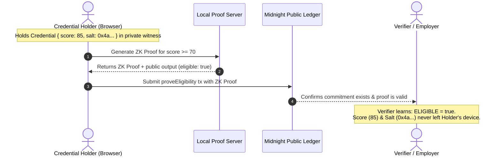

# UmbraCred

Confidential credential verification on [Midnight](https://midnight.network). An issuer commits a credential to the ledger without revealing its contents; the holder later proves the credential meets a public threshold (e.g. "score ≥ 70") without ever revealing the real score, the credential type, or their identity.

## Product idea

Hiring platforms, gated courses, and private communities all need a way to check "does this person hold a valid credential above some bar?" without forcing the person to hand over the underlying document (transcript, certificate, score report). UmbraCred lets an approved issuer register a cryptographic commitment to a credential on Midnight's public ledger, and lets the holder generate a zero-knowledge proof that they know a credential matching that commitment and satisfying a threshold — the verifier learns only the yes/no answer, never the private details.

## Status

🌒 **Level 2 — Waxing Crescent.** 
- **Midnight.js & DApp Connector**: Fully integrated with `@midnight-ntwrk/dapp-connector-api` and `@midnight-ntwrk/midnight-js-*` stack.
- **Lace Wallet Integration**: Header UI provides explicit Connect / Disconnect controls, live connection status, network indicator, and shielded address resolution.
- **Frontend Circuit Calls**: `issueCredential` and `proveEligibility` circuits can be triggered directly from the React/Vite UI with live proving and transaction status.
- **Observable Privacy Demonstration**: Side-by-side verification interface comparing public on-chain ledger state with the client-side private witness (score, salt, and owner keys).
- **Deployment**: Verified end-to-end on Midnight Standalone network with full Preprod testnet scripts and documented infrastructure attempt logs (see [DEPLOYMENT_ATTEMPT.md](DEPLOYMENT_ATTEMPT.md)).

## Privacy Claim (Observable Privacy Behavior)

UmbraCred enforces strict Zero-Knowledge confidentiality guarantees:

### What an Outside Observer / Verifier Learns:
1. **Issuer Public Key**: The registered issuer identity `issuerKey` (public on-chain).
2. **Commitment Existence**: That an opaque 32-byte cryptographic hash `commitment` is recorded on-chain.
3. **Boolean Result**: When `proveEligibility(threshold)` is called, the verifier learns only whether `score >= threshold` evaluates to `true` or `false`.
4. **Validity**: Mathematical certainty that the prover holds a valid credential issued by the approved issuer without re-verifying raw data.

### What Remains Completely Hidden & Never Leaves the Holder's Machine:
1. **Actual Score**: The real credential score (e.g. `85`) is evaluated solely inside the local ZK circuit and is **never** broadcast to the network.
2. **Commitment Salt**: The 32-byte random salt protecting against rainbow-table/brute-force preimage attacks.
3. **Holder Private Keys**: `ownerSecretKey` remains isolated in local browser memory (`inMemoryPrivateStateProvider`).
4. **Issuer Private Key**: `issuerSecretKey` remains private to the issuing authority.



## Setup & Running Locally

Midnight's toolchain runs on Linux/macOS or Windows via **WSL2**:

```powershell
wsl --install          # installs WSL2 + Ubuntu (if not already installed)
```

Inside WSL2 Ubuntu or Linux/macOS:

```bash
# 1. Compact compiler (0.31.0)
curl --proto '=https' --tlsv1.2 -LsSf https://github.com/midnightntwrk/compact/releases/latest/download/compact-installer.sh | sh
source ~/.bashrc
compact update
compact --version

# 2. Node.js (v22 / v24)
curl -o- https://raw.githubusercontent.com/nvm-sh/nvm/v0.40.1/install.sh | bash
nvm install 22
nvm use 22

# 3. Docker proof server
docker run -d -p 6300:6300 midnightntwrk/proof-server:latest midnight-proof-server -v

# 4. Install dependencies & build contract
cd umbracred-app
npm install --legacy-peer-deps
cd contract && npm run compact && npm test
cd ..

# 5. Start the frontend application
cd bboard-ui
npm run dev
```

The frontend will start at `http://localhost:5173` (or configured port). Install the [Midnight Lace Wallet Extension](https://midnight.network) to connect and interact.

## Public ledger state vs. private witness

| Ledger state (public, on-chain) | Private witness (never leaves the holder's machine) |
|---|---|
| `issuerKey: Bytes<32>` — public key of the approved issuer | `localIssuerSecretKey()` — issuer's secret key |
| `credentials: Set<Bytes<32>>` — commitments to issued credentials | `localCredential()` — the actual `Credential { score, salt }` |
| | `localOwnerSecretKey()` — holder's secret key |

The ledger only ever sees a *commitment* (a hash) — never the score, the salt, or either party's secret key.

## `disclose()` — what becomes public, on purpose

- `issueCredential(commitment)` calls `credentials.insert(disclose(commitment))`. The issuer explicitly discloses the commitment hash (an opaque value) so it can be looked up later — never the credential contents it hides.
- `proveEligibility(threshold)` calls `return disclose(cred.score >= threshold)`. Only the **boolean result** of the comparison is disclosed. The real `cred.score` is read from a witness, compared locally inside the circuit, and never leaves the proof as a value — only "did it pass the threshold" does.
- `credentials.member(disclose(commitment))` also needs an explicit `disclose()`: any argument passed into a *ledger container operation* (`Set.member`, `Map.lookup`, ...) counts as a disclosure boundary in Compact, even inside an `assert()` — unlike a plain `==` comparison between two values, which does not. The commitment is just an opaque hash, so disclosing it is intentional and safe; the score/salt behind it stay private.
- The issuer-key check in `issueCredential` (`assert(issuerKey == issuerPublicKey(localIssuerSecretKey()), ...)`) is a plain equality assert, not a ledger operation, so it needs no `disclose()` — it can only fail the proof, never reveal *why*.

## Contract Circuits

See [umbracred-app/contract/src/umbra-cred.compact](umbracred-app/contract/src/umbra-cred.compact):

- `issueCredential(commitment)` — approved issuer registers a credential commitment on-chain.
- `proveEligibility(threshold)` — holder proves their credential's score meets `threshold`, disclosing only `true`/`false`.
- `issuerPublicKey`, `credentialCommitment` — pure helper circuits used to derive the issuer's public key and a credential's commitment hash from witness data.

## Deployment & Verification

- **Automated Test Suite**: 5/5 unit tests pass locally (`npm test` in `contract/`).
- **Continuous Integration**: GitHub Actions CI workflow compiles Compact contracts, validates typecheck, runs linters, and executes the test suite on every push.
- **Standalone Local Demo**: Fully operable end-to-end against local standalone node and proof server.
- **Preprod Testnet Logs**: Complete deployment evidence, wallet funding transactions, and network status details documented in [DEPLOYMENT_ATTEMPT.md](DEPLOYMENT_ATTEMPT.md).
