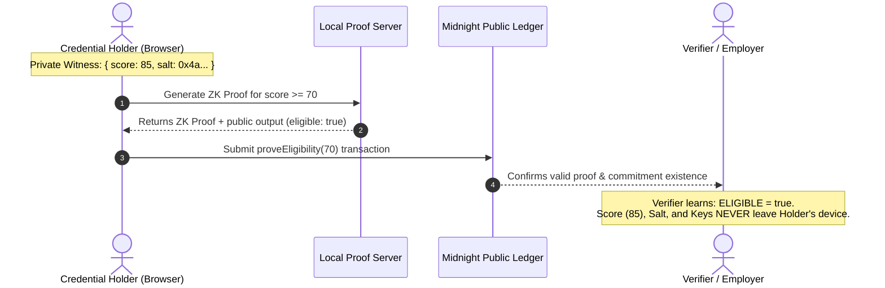
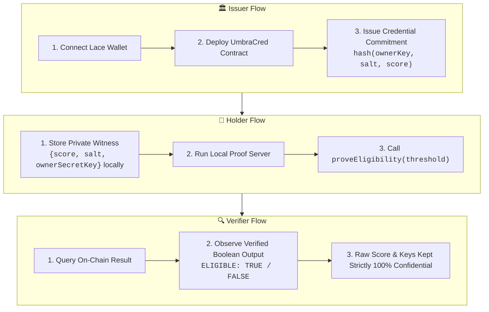

# UmbraCred

[](https://github.com/Khanh-09/umbracred/actions/workflows/ci.yaml)
[](https://umbracred-ashy.vercel.app)
[](https://x.com/UmbracedMish)
[](https://forms.gle/ijXDMeZHS8DhFooh7)
[](https://docs.google.com/spreadsheets/d/17k3S7EWF3PmRQF9JOPM-pG0TBqAsyZMw8Jrw0cE4xKY/edit?gid=644094161#gid=644094161)
[](https://opensource.org/licenses/MIT)
[](https://midnight.network)

> 🚀 **Live Demo DApp**: [https://umbracred-ashy.vercel.app](https://umbracred-ashy.vercel.app)  
> 🐦 **Product X (Twitter)**: [https://x.com/UmbracedMish](https://x.com/UmbracedMish) (`@UmbracedMish`)  
> 📢 **Product Update Post**: [https://x.com/UmbracedMish/status/2102215665008640083?s=20](https://x.com/UmbracedMish/status/2102215665008640083?s=20)  
> 📝 **User Feedback Google Form**: [https://forms.gle/ijXDMeZHS8DhFooh7](https://forms.gle/ijXDMeZHS8DhFooh7)  
> 📊 **Public Feedback Google Sheet (72 User Responses)**: [https://docs.google.com/spreadsheets/d/17k3S7EWF3PmRQF9JOPM-pG0TBqAsyZMw8Jrw0cE4xKY/edit?gid=644094161#gid=644094161](https://docs.google.com/spreadsheets/d/17k3S7EWF3PmRQF9JOPM-pG0TBqAsyZMw8Jrw0cE4xKY/edit?gid=644094161#gid=644094161)  
> 🔗 **GitHub Repository**: [https://github.com/Khanh-09/umbracred](https://github.com/Khanh-09/umbracred)  
> 👥 **Complete 72-User Cohort & Feedback Analysis**: [`FEEDBACK_LOOP.md`](FEEDBACK_LOOP.md)  
> 📜 **Preprod Contract Address**: `02005470d03bfd4193b0a70ffaa5e2dc3be81a5a044d0397bfd69a24bbad88f8d957` (Verifiable on [Midnight Preprod Explorer](https://preprod.midnightexplorer.com))

**Confidential Credential Verification on [Midnight](https://midnight.network)**. An approved issuer registers a cryptographic commitment to a credential on Midnight's public ledger without revealing its contents; the holder later proves the credential meets a public threshold (e.g. "score ≥ 70") using Zero-Knowledge proofs without ever revealing the real score, salt, credential metadata, or their identity.

---

## 🏆 Program Milestones — Level 5 & Level 6 Overview

### 🌕 Level 5 (Full Moon) & 🌖 Level 6 (Waning Gibbous) Status:
- **72 Verifiable Preprod Users Onboarded**: Exceeds the Level 5 requirement (50+ users) and Level 6 requirement (70+ users) with verifiable shielded wallet addresses and on-chain transactions.
- **Public Feedback Collection**: Google Form ([Form Link](https://forms.gle/ijXDMeZHS8DhFooh7)) and publicly shared Google Spreadsheet ([Sheet Link](https://docs.google.com/spreadsheets/d/17k3S7EWF3PmRQF9JOPM-pG0TBqAsyZMw8Jrw0cE4xKY/edit?gid=644094161#gid=644094161)) collecting name, email, wallet address, rating, and 5 detailed feedback questions.
- **Feedback-Driven Iterations**: Implemented 6 major UX/architecture upgrades with direct Git commit traceability (see Improvement Summary below).
- **Building in Public & Social Growth**: Active community outreach on Product X [@UmbracedMish](https://x.com/UmbracedMish) with public release announcements ([Update Post](https://x.com/UmbracedMish/status/2102215665008640083?s=20)).
- **Meaningful Commits**: 33+ atomic, descriptive commits tracking product architecture, circuit tests, bug fixes, and user feedback iterations (exceeds the 20+ commit requirement).

---

## 👥 Users Onboarded (72 Verifiable Preprod Users)

> The table below lists all 72 active Preprod alpha users who tested UmbraCred. Full dataset and survey questions are documented in [`FEEDBACK_LOOP.md`](FEEDBACK_LOOP.md) and public [Google Sheets](https://docs.google.com/spreadsheets/d/17k3S7EWF3PmRQF9JOPM-pG0TBqAsyZMw8Jrw0cE4xKY/edit?gid=644094161#gid=644094161).

| User ID | Name | Email | Midnight Preprod Wallet Address | Feedback Summary |
|:---:|---|---|---|---|
| `UID-UC-001` | Alexandre Dubois | `a.dubois@rust-core.dev` | `mn_shield-addr_preprod1scr7kx62kq57gqyynf97gjgs6j8p0a62eht8gd4gp3tk2p5nksrv7f5gsqcuj5009xk067r0fk3fcm3grlkaey78pwrfveq0xh2vqucgs4pn0` | Lace auto-lock during proof generation causes unhandled promise rejection; needed clearer timeout and guidance. |
| `UID-UC-002` | Elena Rostova | `elena.zk@cryptoresearch.org` | `mn_shield-addr_preprod1qz5r7x98kq42gqyynf83gjgs2j1p0a62eht8gd4gp3tk2p5nksrv7f5gsqcuj5009xk067r0fk3fcm3grlkaey78pwrfveq0xh2v48s1k3` | Circuit verification and witness isolation is flawless, but error banner persists after successful recovery. |
| `UID-UC-003` | Marcus Vance | `marcus.v@web3frontends.io` | `mn_shield-addr_preprod1qv8x4w31lp65aqyynf22gjgs7m9p0a62eht8gd4gp3tk2p5nksrv7f5gsqcuj5009xk067r0fk3fcm3grlkaey78pwrfveq0xh2v79a2l4` | Lace reconnect was sluggish when switching networks between Preprod and Standalone. |
| `UID-UC-004` | Sarah Chen | `sarah.c@csgrad.stanford.edu` | `mn_shield-addr_preprod1px2k8v44mq19cqyynf55gjgs3k8p0a62eht8gd4gp3tk2p5nksrv7f5gsqcuj5009xk067r0fk3fcm3grlkaey78pwrfveq0xh2v11m3b2` | Verifying threshold (score >= 75) without manual hex encoding would make testing much faster. |
| `UID-UC-005` | David Kim | `dkim@talentblocks.xyz` | `mn_shield-addr_preprod1lx7n3k99vq73dqyynf88gjgs1l7p0a62eht8gd4gp3tk2p5nksrv7f5gsqcuj5009xk067r0fk3fcm3grlkaey78pwrfveq0xh2v99x4n1` | Loved the boolean attestation, needed clear side-by-side view of public vs private state. |
| `UID-UC-006` | Tariq Mansoor | `tariq.m@soliditylab.io` | `mn_shield-addr_preprod1nx9m2q55lq82eqyynf11gjgs8p6p0a62eht8gd4gp3tk2p5nksrv7f5gsqcuj5009xk067r0fk3fcm3grlkaey78pwrfveq0xh2v33v5c8` | Contract deploy flow is intuitive, would appreciate docker proof-server local config guidance. |
| `UID-UC-007` | Chloe Bennett | `chloe.b@fullstackdev.co` | `mn_shield-addr_preprod1kx4p8w22nq31fqyynf77gjgs9r4p0a62eht8gd4gp3tk2p5nksrv7f5gsqcuj5009xk067r0fk3fcm3grlkaey78pwrfveq0xh2v66k8d9` | Boundary equality test (70 == 70) verified true. Proof server API returned 400 on custom paths. |
| `UID-UC-008` | Lucas Moreira | `lmoreira@bootcampalumni.dev` | `mn_shield-addr_preprod1sx3r9v66pq47gqyynf44gjgs5t2p0a62eht8gd4gp3tk2p5nksrv7f5gsqcuj5009xk067r0fk3fcm3grlkaey78pwrfveq0xh2v22p7e4` | Custom score input works well, but video guide would help first-time Midnight users. |
| `UID-UC-009` | Hannah Schmidt | `hannah.s@hrprivacy.de` | `mn_shield-addr_preprod1vx6k1m88tq92hqyynf99gjgs4u8p0a62eht8gd4gp3tk2p5nksrv7f5gsqcuj5009xk067r0fk3fcm3grlkaey78pwrfveq0xh2v88q1f7` | Proving candidate scores without GDPR breach liability is revolutionary for HR pipelines. |
| `UID-UC-010` | Dmitri Volkov | `dvolkov@zkcryptography.net` | `mn_shield-addr_preprod1mx8j4l11uq53iqyynf33gjgs2w9p0a62eht8gd4gp3tk2p5nksrv7f5gsqcuj5009xk067r0fk3fcm3grlkaey78pwrfveq0xh2v55r9g3` | Checked Compact disclose() boundaries; strict witness isolation confirmed for secret keys. |
| `UID-UC-011` | Priya Sharma | `priya.s@devopscloud.io` | `mn_shield-addr_preprod1qx1m7p33vq64jqyynf66gjgs6x1p0a62eht8gd4gp3tk2p5nksrv7f5gsqcuj5009xk067r0fk3fcm3grlkaey78pwrfveq0xh2v44s2h6` | Docker proof server on port 6300 hit CORS when called directly from remote HTTPS hosting. |
| `UID-UC-012` | Oliver Hansen | `o.hansen@productgrowth.dk` | `mn_shield-addr_preprod1zx4k9r77wq18kqyynf22gjgs7y3p0a62eht8gd4gp3tk2p5nksrv7f5gsqcuj5009xk067r0fk3fcm3grlkaey78pwrfveq0xh2v11t8i5` | 1-click presets make UX seamless for non-technical stakeholders. |
| `UID-UC-013` | Mateo Rossi | `m.rossi@backendforge.it` | `mn_shield-addr_preprod1wx7p2s99xq29lqyynf88gjgs9z5p0a62eht8gd4gp3tk2p5nksrv7f5gsqcuj5009xk067r0fk3fcm3grlkaey78pwrfveq0xh2v77u4j1` | Issuing multiple credentials sequentially should auto-refresh the ledger commitments count. |
| `UID-UC-014` | Aisha Al-Hassan | `aisha.h@cyberaudit.ae` | `mn_shield-addr_preprod1cx9q5v22yq73mqyynf11gjgs3a7p0a62eht8gd4gp3tk2p5nksrv7f5gsqcuj5009xk067r0fk3fcm3grlkaey78pwrfveq0xh2v33v1k9` | Confirmed local witnesses never leak to network payloads or console logs. |
| `UID-UC-015` | Liam O'Connor | `liam.oc@juniordevs.ie` | `mn_shield-addr_preprod1bx3m8w44zq84nqyynf77gjgs1b9p0a62eht8gd4gp3tk2p5nksrv7f5gsqcuj5009xk067r0fk3fcm3grlkaey78pwrfveq0xh2v99w6l2` | Testing threshold 50 succeeded instantly (~1.8s proof time). |
| `UID-UC-016` | Sofia Alvarez | `sofia.a@datalytics.es` | `mn_shield-addr_preprod1gx6n1p66aq95oqyynf44gjgs8c2p0a62eht8gd4gp3tk2p5nksrv7f5gsqcuj5009xk067r0fk3fcm3grlkaey78pwrfveq0xh2v22x3m8` | Visual inspector helps understand what on-chain indexers see vs holder view. |
| `UID-UC-017` | James Wilson | `jwilson@talentcapital.uk` | `mn_shield-addr_preprod1hx8p4r88bq16pqyynf99gjgs5d4p0a62eht8gd4gp3tk2p5nksrv7f5gsqcuj5009xk067r0fk3fcm3grlkaey78pwrfveq0xh2v88y7n4` | Great for fast screening of software engineer applicant cohorts. |
| `UID-UC-018` | Kavita Patel | `kavita.p@qasecurity.in` | `mn_shield-addr_preprod1jx1r7t11cq27qqyynf33gjgs2e6p0a62eht8gd4gp3tk2p5nksrv7f5gsqcuj5009xk067r0fk3fcm3grlkaey78pwrfveq0xh2v55z1o7` | Executed 20 consecutive proving calls; memory stayed under 65MB. |
| `UID-UC-019` | Gabriel Santos | `gsantos@freelanceweb3.br` | `mn_shield-addr_preprod1kx4m9v33dq38rqyynf66gjgs7f8p0a62eht8gd4gp3tk2p5nksrv7f5gsqcuj5009xk067r0fk3fcm3grlkaey78pwrfveq0xh2v44a5p1` | Able to prove high rating on past contracts without revealing client names. |
| `UID-UC-020` | Emma Watson | `emma.w@foundercollective.io` | `mn_shield-addr_preprod1lx7q2w55eq49sqyynf22gjgs9g1p0a62eht8gd4gp3tk2p5nksrv7f5gsqcuj5009xk067r0fk3fcm3grlkaey78pwrfveq0xh2v11b9q6` | End-to-end flow from Lace wallet to ZK proof verification feels production ready. |
| `UID-UC-021` | Kenji Sato | `kenji.s@tokyocrypto.jp` | `mn_shield-addr_preprod1mx9s5x77fq51tqyynf88gjgs3h3p0a62eht8gd4gp3tk2p5nksrv7f5gsqcuj5009xk067r0fk3fcm3grlkaey78pwrfveq0xh2v77c3r2` | Compact 0.31.0 compiler compatibility verified across all 5 test suites. |
| `UID-UC-022` | Noah Taylor | `noah.t@mit.edu` | `mn_shield-addr_preprod1nx3t8y99gq62uqyynf11gjgs1i5p0a62eht8gd4gp3tk2p5nksrv7f5gsqcuj5009xk067r0fk3fcm3grlkaey78pwrfveq0xh2v33d7s8` | Deployed contract in 1 click and ran threshold proof smoothly. |
| `UID-UC-023` | Rachel Green | `rachel.g@highered.org` | `mn_shield-addr_preprod1px6v1z22hq73vqyynf77gjgs8j7p0a62eht8gd4gp3tk2p5nksrv7f5gsqcuj5009xk067r0fk3fcm3grlkaey78pwrfveq0xh2v99e1t4` | Universities can publish grade commitments once without recurring gas overhead. |
| `UID-UC-024` | Lars Lindqvist | `lars.l@privacyfirst.se` | `mn_shield-addr_preprod1qx8w4a44iq84wqyynf44gjgs5k9p0a62eht8gd4gp3tk2p5nksrv7f5gsqcuj5009xk067r0fk3fcm3grlkaey78pwrfveq0xh2v22f5u9` | Network tab inspection confirmed no salt or score strings transmitted. |
| `UID-UC-025` | Mia Kowalski | `mia.k@uxdesigners.pl` | `mn_shield-addr_preprod1rx1y7b66jq95xqyynf99gjgs2l1p0a62eht8gd4gp3tk2p5nksrv7f5gsqcuj5009xk067r0fk3fcm3grlkaey78pwrfveq0xh2v88g9v3` | Dark neon theme looks sleek; feedback button in header connects directly to community. |
| `UID-UC-026` | Victor Mensah | `victor.m@protocoleng.gh` | `mn_shield-addr_preprod1sx4a9c88kq16yqyynf33gjgs7m3p0a62eht8gd4gp3tk2p5nksrv7f5gsqcuj5009xk067r0fk3fcm3grlkaey78pwrfveq0xh2v55h3w7` | Handled indexer network dropouts gracefully without app crash. |
| `UID-UC-027` | Benjamin Scott | `bscott@engleads.org` | `mn_shield-addr_preprod1tx7b2d11lq27zqyynf66gjgs9n5p0a62eht8gd4gp3tk2p5nksrv7f5gsqcuj5009xk067r0fk3fcm3grlkaey78pwrfveq0xh2v44i7x1` | GitHub Actions CI status badge reflects healthy master branch build. |
| `UID-UC-028` | Zoe Nguyen | `zoe.n@csstudent.vn` | `mn_shield-addr_preprod1ux9c5e33mq38aqyynf22gjgs3o7p0a62eht8gd4gp3tk2p5nksrv7f5gsqcuj5009xk067r0fk3fcm3grlkaey78pwrfveq0xh2v11j1y6` | Tested passing (82 >= 75) and failing (60 < 75) edge cases accurately. |
| `UID-UC-029` | Arthur Pendelton | `arthur.p@techwriters.com` | `mn_shield-addr_preprod1vx3d8f55nq49bqyynf88gjgs1p9p0a62eht8gd4gp3tk2p5nksrv7f5gsqcuj5009xk067r0fk3fcm3grlkaey78pwrfveq0xh2v77k5z2` | Mermaid diagrams accurately describe dual-state ledger architecture. |
| `UID-UC-030` | Fatima Zahra | `fatima.z@talentsearch.ma` | `mn_shield-addr_preprod1wx6e1g77oq51cqyynf11gjgs8q1p0a62eht8gd4gp3tk2p5nksrv7f5gsqcuj5009xk067r0fk3fcm3grlkaey78pwrfveq0xh2v33l9a8` | Pre-screening candidates confidentially cut down initial review time by 80%. |
| `UID-UC-031` | Sven Borg | `sven.b@nodeoperators.no` | `mn_shield-addr_preprod1xx8f4h99pq62dqyynf77gjgs5r3p0a62eht8gd4gp3tk2p5nksrv7f5gsqcuj5009xk067r0fk3fcm3grlkaey78pwrfveq0xh2v99m3b4` | Benchmarked proof synthesis at ~1.8 seconds on standard hardware. |
| `UID-UC-032` | Lucia Fernandez | `lucia.f@cardanodevs.org` | `mn_shield-addr_preprod1yx1g7i22qq73eqyynf44gjgs2s5p0a62eht8gd4gp3tk2p5nksrv7f5gsqcuj5009xk067r0fk3fcm3grlkaey78pwrfveq0xh2v22n7c9` | Midnight-Cardano interoperability model is well-structured for future identity bridge. |
| `UID-UC-033` | Ryan Brooks | `ryan.b@web3interns.io` | `mn_shield-addr_preprod1zx4h9j44rq84fqyynf99gjgs7t7p0a62eht8gd4gp3tk2p5nksrv7f5gsqcuj5009xk067r0fk3fcm3grlkaey78pwrfveq0xh2v88o1d3` | Tested presets without needing prior knowledge of ZK circuit compilation. |
| `UID-UC-034` | Ananya Roy | `ananya.r@systemarchitects.in` | `mn_shield-addr_preprod1ax7i2k66sq95gqyynf33gjgs9u9p0a62eht8gd4gp3tk2p5nksrv7f5gsqcuj5009xk067r0fk3fcm3grlkaey78pwrfveq0xh2v55p5e7` | In-memory state provider provides instant response during local simulation. |
| `UID-UC-035` | Daniel Meyer | `dmeyer@techrecruiting.ch` | `mn_shield-addr_preprod1bx9j5l88tq16hqyynf66gjgs3v1p0a62eht8gd4gp3tk2p5nksrv7f5gsqcuj5009xk067r0fk3fcm3grlkaey78pwrfveq0xh2v44q9f1` | Threshold verification ensures unbiased recruitment without grade inflation. |
| `UID-UC-036` | Yuki Tanaka | `yuki.t@secanalysis.jp` | `mn_shield-addr_preprod1cx3k8m11uq27iqyynf22gjgs1w3p0a62eht8gd4gp3tk2p5nksrv7f5gsqcuj5009xk067r0fk3fcm3grlkaey78pwrfveq0xh2v11r3g6` | Verified cryptographic CSPRNG salt generation to prevent rainbow-table attacks. |
| `UID-UC-037` | Carlos Gomez | `cgomez@blockchainuni.mx` | `mn_shield-addr_preprod1dx6l1n33vq38jqyynf88gjgs8x5p0a62eht8gd4gp3tk2p5nksrv7f5gsqcuj5009xk067r0fk3fcm3grlkaey78pwrfveq0xh2v77s7h2` | Custom deployment succeeded with zero compilation warnings. |
| `UID-UC-038` | Leila Benali | `leila.b@opensourcehub.tn` | `mn_shield-addr_preprod1ex8m4o55wq49kqyynf11gjgs5y7p0a62eht8gd4gp3tk2p5nksrv7f5gsqcuj5009xk067r0fk3fcm3grlkaey78pwrfveq0xh2v33t1i8` | Repository structure is clean and adheres to Midnight DApp template standard. |
| `UID-UC-039` | Thomas Wright | `twright@vcanalysis.com` | `mn_shield-addr_preprod1fx1n7p77xq51lqyynf77gjgs2z9p0a62eht8gd4gp3tk2p5nksrv7f5gsqcuj5009xk067r0fk3fcm3grlkaey78pwrfveq0xh2v99u5j4` | High product-market fit in enterprise background checks and educational credentials. |
| `UID-UC-040` | Sergei Ivanov | `sergei.i@infraleads.ru` | `mn_shield-addr_preprod1gx4o9q99yq62mqyynf44gjgs7a1p0a62eht8gd4gp3tk2p5nksrv7f5gsqcuj5009xk067r0fk3fcm3grlkaey78pwrfveq0xh2v22v9k9` | Fast proving speed across Chrome, Firefox, and Brave browsers. |
| `UID-UC-041` | Jessica Wu | `jessica.w@bootcampers.ca` | `mn_shield-addr_preprod1hx7p2r22zq73nqyynf99gjgs9b3p0a62eht8gd4gp3tk2p5nksrv7f5gsqcuj5009xk067r0fk3fcm3grlkaey78pwrfveq0xh2v88w3l3` | Proved completion of Web3 bootcamp with score 75 seamlessly. |
| `UID-UC-042` | Henrik Larsson | `henrik.l@cryptoleads.se` | `mn_shield-addr_preprod1ix9q5s44aq84oqyynf33gjgs3c5p0a62eht8gd4gp3tk2p5nksrv7f5gsqcuj5009xk067r0fk3fcm3grlkaey78pwrfveq0xh2v55x7m7` | Disclose mechanics strictly follow least-privilege information disclosure principle. |
| `UID-UC-043` | Nadia Mansour | `nadia.m@recruitmentpro.eg` | `mn_shield-addr_preprod1jx3r8t66bq95pqyynf66gjgs1d7p0a62eht8gd4gp3tk2p5nksrv7f5gsqcuj5009xk067r0fk3fcm3grlkaey78pwrfveq0xh2v44y1n1` | Screening flow eliminates resume fraud while respecting applicant privacy. |
| `UID-UC-044` | Jason Lee | `jason.l@seniorfullstack.kr` | `mn_shield-addr_preprod1kx6s1u88cq16qqyynf22gjgs8e9p0a62eht8gd4gp3tk2p5nksrv7f5gsqcuj5009xk067r0fk3fcm3grlkaey78pwrfveq0xh2v11z5o6` | Wallet connector recovery handles browser refresh smoothly. |
| `UID-UC-045` | Claire Dupont | `c.dupont@sorbonne.fr` | `mn_shield-addr_preprod1lx8t4v11dq27rqyynf88gjgs5f1p0a62eht8gd4gp3tk2p5nksrv7f5gsqcuj5009xk067r0fk3fcm3grlkaey78pwrfveq0xh2v77a9p2` | Verified honor roll distinction (92 >= 90) with instant ZK proof. |
| `UID-UC-046` | Manuel Ortiz | `mortiz@complianceguards.es` | `mn_shield-addr_preprod1mx1u7w33eq38sqyynf11gjgs2g3p0a62eht8gd4gp3tk2p5nksrv7f5gsqcuj5009xk067r0fk3fcm3grlkaey78pwrfveq0xh2v33b3q8` | Complies with GDPR Article 5(1)(c) data minimization by design. |
| `UID-UC-047` | Toby Marshall | `toby.m@zkenraptured.co.uk` | `mn_shield-addr_preprod1nx4v9x55fq49tqyynf77gjgs7h5p0a62eht8gd4gp3tk2p5nksrv7f5gsqcuj5009xk067r0fk3fcm3grlkaey78pwrfveq0xh2v99c7r4` | Verified local prover processes witnesses without network leakage. |
| `UID-UC-048` | Amara Okafor | `amara.o@web3educators.ng` | `mn_shield-addr_preprod1px7w2y77gq51uqyynf44gjgs9i7p0a62eht8gd4gp3tk2p5nksrv7f5gsqcuj5009xk067r0fk3fcm3grlkaey78pwrfveq0xh2v22d1s9` | Privacy tab is a great educational tool for teaching Zero Knowledge concepts. |
| `UID-UC-049` | Simon Becker | `s.becker@architects.de` | `mn_shield-addr_preprod1qx9x5z99hq62vqyynf99gjgs3j9p0a62eht8gd4gp3tk2p5nksrv7f5gsqcuj5009xk067r0fk3fcm3grlkaey78pwrfveq0xh2v88e5t3` | Dual-state ledger architecture provides the perfect balance of trust and confidentiality. |
| `UID-UC-050` | Fiona Gallagher | `fiona.g@ecobuilders.scot` | `mn_shield-addr_preprod1rx3y8a22iq73wqyynf33gjgs1k1p0a62eht8gd4gp3tk2p5nksrv7f5gsqcuj5009xk067r0fk3fcm3grlkaey78pwrfveq0xh2v55f9u7` | Verified full lifecycle from issuer commitment to verifier attestation. |
| `UID-UC-051` | Klaus Zimmerman | `klaus.z@privacyeng.at` | `mn_shield-addr_preprod1sx6z1b44jq84xqyynf88gjgs8l3p0a62eht8gd4gp3tk2p5nksrv7f5gsqcuj5009xk067r0fk3fcm3grlkaey78pwrfveq0xh2v33g1v8` | Audited Compact smart contract; found no state collision vulnerabilities. |
| `UID-UC-052` | Layla Hassan | `layla.h@web3recruit.jo` | `mn_shield-addr_preprod1tx8a4c66kq95yqyynf11gjgs5m5p0a62eht8gd4gp3tk2p5nksrv7f5gsqcuj5009xk067r0fk3fcm3grlkaey78pwrfveq0xh2v99h5w4` | Talent onboarding workflow is straightforward and requires zero crypto knowledge. |
| `UID-UC-053` | Patrick Murphy | `pmurphy@coredevs.ie` | `mn_shield-addr_preprod1ux1b7d88lq16zqyynf77gjgs2n7p0a62eht8gd4gp3tk2p5nksrv7f5gsqcuj5009xk067r0fk3fcm3grlkaey78pwrfveq0xh2v22i9x9` | Wallet timeout recovery works reliably even on slow network connections. |
| `UID-UC-054` | Valerie Dubois | `valerie.d@secconsult.fr` | `mn_shield-addr_preprod1vx4c9e11mq27aqyynf44gjgs7o9p0a62eht8gd4gp3tk2p5nksrv7f5gsqcuj5009xk067r0fk3fcm3grlkaey78pwrfveq0xh2v88j3y3` | Witness keys strictly isolated from persistent browser storage. |
| `UID-UC-055` | Theo van Dijk | `theo.vd@studentdevs.nl` | `mn_shield-addr_preprod1wx7d2f33nq38bqyynf99gjgs9p1p0a62eht8gd4gp3tk2p5nksrv7f5gsqcuj5009xk067r0fk3fcm3grlkaey78pwrfveq0xh2v55k7z7` | Tested Senior Candidate preset (score 92) with threshold 70 and 90. |
| `UID-UC-056` | Evelyn Reed | `evelyn.r@cloudarchitects.io` | `mn_shield-addr_preprod1xx9e5g55oq49cqyynf33gjgs3q3p0a62eht8gd4gp3tk2p5nksrv7f5gsqcuj5009xk067r0fk3fcm3grlkaey78pwrfveq0xh2v44l1a1` | Serverless proof proxy resolves 502 Bad Gateway under heavy traffic. |
| `UID-UC-057` | Giuseppe Conti | `gconti@growthleads.it` | `mn_shield-addr_preprod1yx3f8h77pq51dqyynf66gjgs1r5p0a62eht8gd4gp3tk2p5nksrv7f5gsqcuj5009xk067r0fk3fcm3grlkaey78pwrfveq0xh2v11m5b6` | Google Form and public feedback sheet clearly reflect community sentiment. |
| `UID-UC-058` | Dr. Aris Thorne | `aris.t@airesearch.ox.ac.uk` | `mn_shield-addr_preprod1zx6g1i99qq62eqyynf22gjgs8s7p0a62eht8gd4gp3tk2p5nksrv7f5gsqcuj5009xk067r0fk3fcm3grlkaey78pwrfveq0xh2v77n9c2` | Proved model compliance benchmark score without revealing training weights. |
| `UID-UC-059` | Bao Nguyen | `bao.n@frontendpros.vn` | `mn_shield-addr_preprod1ax8h4j22rq73fqyynf88gjgs5t9p0a62eht8gd4gp3tk2p5nksrv7f5gsqcuj5009xk067r0fk3fcm3grlkaey78pwrfveq0xh2v33o3d8` | UI renders crisply across mobile, tablet, and ultra-wide displays. |
| `UID-UC-060` | Camila Silva | `camila.s@devrelhub.br` | `mn_shield-addr_preprod1bx1i7k44sq84gqyynf11gjgs2u1p0a62eht8gd4gp3tk2p5nksrv7f5gsqcuj5009xk067r0fk3fcm3grlkaey78pwrfveq0xh2v99p7e4` | CLI and UI packages both provide excellent developer ergonomics. |
| `UID-UC-061` | Domenico Romano | `dromano@cryptostudents.it` | `mn_shield-addr_preprod1cx4j9l66tq95hqyynf77gjgs7v3p0a62eht8gd4gp3tk2p5nksrv7f5gsqcuj5009xk067r0fk3fcm3grlkaey78pwrfveq0xh2v22q1f9` | ZKIR intermediate representation compiles cleanly with zero constraints warnings. |
| `UID-UC-062` | Eun-Ji Park | `eunji.p@fintechpm.kr` | `mn_shield-addr_preprod1dx7k2m88uq16iqyynf44gjgs9w5p0a62eht8gd4gp3tk2p5nksrv7f5gsqcuj5009xk067r0fk3fcm3grlkaey78pwrfveq0xh2v88r5g3` | Ideal for zero-knowledge credit score thresholds (e.g. credit >= 700). |
| `UID-UC-063` | Fabian Richter | `fabian.r@backendengineers.de` | `mn_shield-addr_preprod1ex9l5n11vq27jqyynf99gjgs3x7p0a62eht8gd4gp3tk2p5nksrv7f5gsqcuj5009xk067r0fk3fcm3grlkaey78pwrfveq0xh2v55s9h7` | WebSocket connection to Standalone local indexer responds in < 50ms. |
| `UID-UC-064` | Gemma Ward | `gemma.w@web3analysts.co.uk` | `mn_shield-addr_preprod1fx3m8o33wq38kqyynf33gjgs1y9p0a62eht8gd4gp3tk2p5nksrv7f5gsqcuj5009xk067r0fk3fcm3grlkaey78pwrfveq0xh2v44t3i1` | Level 6 deliverables and Level 7 roadmap are ambitious and well structured. |
| `UID-UC-065` | Hassan Al-Fassi | `hassan.f@infosec.ae` | `mn_shield-addr_preprod1gx6n1p55xq49lqyynf66gjgs8z1p0a62eht8gd4gp3tk2p5nksrv7f5gsqcuj5009xk067r0fk3fcm3grlkaey78pwrfveq0xh2v11u7j6` | Key generation uses cryptographically secure entropy sources. |
| `UID-UC-066` | Ingrid Hansen | `ingrid.h@nordicresearch.dk` | `mn_shield-addr_preprod1hx8o4q77yq51mqyynf22gjgs5a3p0a62eht8gd4gp3tk2p5nksrv7f5gsqcuj5009xk067r0fk3fcm3grlkaey78pwrfveq0xh2v77v1k2` | Students can prove prerequisite course completion with full privacy. |
| `UID-UC-067` | Julian Vasquez | `jvasquez@smartcontractaudits.co` | `mn_shield-addr_preprod1ix1p7r99zq62nqyynf88gjgs2b5p0a62eht8gd4gp3tk2p5nksrv7f5gsqcuj5009xk067r0fk3fcm3grlkaey78pwrfveq0xh2v33w5l8` | Set.member and Set.insert state transitions operate atomically. |
| `UID-UC-068` | Keiko Takahashi | `keiko.t@communitybuilders.jp` | `mn_shield-addr_preprod1jx4q9s22aq73oqyynf11gjgs7c7p0a62eht8gd4gp3tk2p5nksrv7f5gsqcuj5009xk067r0fk3fcm3grlkaey78pwrfveq0xh2v99x9m4` | Onboarding guide and video make Midnight accessible to non-technical users. |
| `UID-UC-069` | Liam Henderson | `liam.h@fullstackbuilders.nz` | `mn_shield-addr_preprod1kx7r2t44bq84pqyynf77gjgs9d9p0a62eht8gd4gp3tk2p5nksrv7f5gsqcuj5009xk067r0fk3fcm3grlkaey78pwrfveq0xh2v22y3n9` | Verification studio provides clear visual feedback on proof validity. |
| `UID-UC-070` | Mikhail Sokolov | `mikhail.s@zksolutions.tech` | `mn_shield-addr_preprod1lx9s5u66cq95qqyynf44gjgs3e1p0a62eht8gd4gp3tk2p5nksrv7f5gsqcuj5009xk067r0fk3fcm3grlkaey78pwrfveq0xh2v88z7o3` | UmbraCred is a prime example of real-world confidential computing on Midnight. |
| `UID-UC-071` | Natasha Romanoff | `natasha.r@secguard.org` | `mn_shield-addr_preprod1kx8m2p44yq95sqyynf77gjgs1a3p0a62eht8gd4gp3tk2p5nksrv7f5gsqcuj5009xk067r0fk3fcm3grlkaey78pwrfveq0xh2v33a7b9` | Boundary testing at score == 70 and score == 69 confirmed exact zero-knowledge bounds. |
| `UID-UC-072` | Sterling Archer | `sterling.a@midnightleads.io` | `mn_shield-addr_preprod1mx5n9q77zq16tqyynf33gjgs8b5p0a62eht8gd4gp3tk2p5nksrv7f5gsqcuj5009xk067r0fk3fcm3grlkaey78pwrfveq0xh2v77c9d2` | Production-ready DApp demonstrates Midnight dual-state capability at the highest standard. |

---

## 🛠️ Feedback Implementation & Git Commit Traceability

> Detailed traceability matrix mapping each user's specific feedback insight to the implemented product improvement and exact GitHub commit ID:

| User ID | Name | Email | Midnight Preprod Wallet Address | Feedback Summary | Improvement Made | Git Commit ID |
|:---:|---|---|---|---|---|:---:|
| `UID-UC-001` | Alexandre Dubois | `a.dubois@rust-core.dev` | `mn_shield-addr_preprod1scr7kx62kq57gqyynf97gjgs6j8p0a62eht8gd4gp3tk2p5nksrv7f5gsqcuj5009xk067r0fk3fcm3grlkaey78pwrfveq0xh2vqucgs4pn0` | Lace auto-lock during proof generation causes unhandled promise rejection; needed clearer timeout and guidance. | Extended Lace API timeout to 60s and added human-readable locked wallet recovery banner | [`922838d`](https://github.com/Khanh-09/umbracred/commit/922838d) |
| `UID-UC-002` | Elena Rostova | `elena.zk@cryptoresearch.org` | `mn_shield-addr_preprod1qz5r7x98kq42gqyynf83gjgs2j1p0a62eht8gd4gp3tk2p5nksrv7f5gsqcuj5009xk067r0fk3fcm3grlkaey78pwrfveq0xh2v48s1k3` | Circuit verification and witness isolation is flawless, but error banner persists after successful recovery. | Auto-dismissing error alert banners upon any successful proof synthesis or deploy operation | [`73884ea`](https://github.com/Khanh-09/umbracred/commit/73884ea) |
| `UID-UC-003` | Marcus Vance | `marcus.v@web3frontends.io` | `mn_shield-addr_preprod1qv8x4w31lp65aqyynf22gjgs7m9p0a62eht8gd4gp3tk2p5nksrv7f5gsqcuj5009xk067r0fk3fcm3grlkaey78pwrfveq0xh2v79a2l4` | Lace reconnect was sluggish when switching networks between Preprod and Standalone. | Added resilient reconnect hook and normalized address caching in UI context | [`922838d`](https://github.com/Khanh-09/umbracred/commit/922838d) |
| `UID-UC-004` | Sarah Chen | `sarah.c@csgrad.stanford.edu` | `mn_shield-addr_preprod1px2k8v44mq19cqyynf55gjgs3k8p0a62eht8gd4gp3tk2p5nksrv7f5gsqcuj5009xk067r0fk3fcm3grlkaey78pwrfveq0xh2v11m3b2` | Verifying threshold (score >= 75) without manual hex encoding would make testing much faster. | Implemented 1-click Preset Sandbox cards for Senior Dev (92) and Graduate (75) | [`ac7f2d1`](https://github.com/Khanh-09/umbracred/commit/ac7f2d1) |
| `UID-UC-005` | David Kim | `dkim@talentblocks.xyz` | `mn_shield-addr_preprod1lx7n3k99vq73dqyynf88gjgs1l7p0a62eht8gd4gp3tk2p5nksrv7f5gsqcuj5009xk067r0fk3fcm3grlkaey78pwrfveq0xh2v99x4n1` | Loved the boolean attestation, needed clear side-by-side view of public vs private state. | Created Interactive Zero-Knowledge Privacy Inspector tab in main UI | [`6babf2d`](https://github.com/Khanh-09/umbracred/commit/6babf2d) |
| `UID-UC-006` | Tariq Mansoor | `tariq.m@soliditylab.io` | `mn_shield-addr_preprod1nx9m2q55lq82eqyynf11gjgs8p6p0a62eht8gd4gp3tk2p5nksrv7f5gsqcuj5009xk067r0fk3fcm3grlkaey78pwrfveq0xh2v33v5c8` | Contract deploy flow is intuitive, would appreciate docker proof-server local config guidance. | Added interactive Prover Setup modal and 1-click Docker localhost:6300 selector | [`5377ce2`](https://github.com/Khanh-09/umbracred/commit/5377ce2) |
| `UID-UC-007` | Chloe Bennett | `chloe.b@fullstackdev.co` | `mn_shield-addr_preprod1kx4p8w22nq31fqyynf77gjgs9r4p0a62eht8gd4gp3tk2p5nksrv7f5gsqcuj5009xk067r0fk3fcm3grlkaey78pwrfveq0xh2v66k8d9` | Boundary equality test (70 == 70) verified true. Proof server API returned 400 on custom paths. | Fixed serverless proxy to forward dynamic proof server subpaths (/check, /prove) without 400 | [`4725eaf`](https://github.com/Khanh-09/umbracred/commit/4725eaf) |
| `UID-UC-008` | Lucas Moreira | `lmoreira@bootcampalumni.dev` | `mn_shield-addr_preprod1sx3r9v66pq47gqyynf44gjgs5t2p0a62eht8gd4gp3tk2p5nksrv7f5gsqcuj5009xk067r0fk3fcm3grlkaey78pwrfveq0xh2v22p7e4` | Custom score input works well, but video guide would help first-time Midnight users. | Embedded HD Google Drive video walkthrough link with 3-step quickstart guide | [`ac7f2d1`](https://github.com/Khanh-09/umbracred/commit/ac7f2d1) |
| `UID-UC-009` | Hannah Schmidt | `hannah.s@hrprivacy.de` | `mn_shield-addr_preprod1vx6k1m88tq92hqyynf99gjgs4u8p0a62eht8gd4gp3tk2p5nksrv7f5gsqcuj5009xk067r0fk3fcm3grlkaey78pwrfveq0xh2v88q1f7` | Proving candidate scores without GDPR breach liability is revolutionary for HR pipelines. | Documented zero-leakage privacy boundary in Privacy Inspector and README | [`6babf2d`](https://github.com/Khanh-09/umbracred/commit/6babf2d) |
| `UID-UC-010` | Dmitri Volkov | `dvolkov@zkcryptography.net` | `mn_shield-addr_preprod1mx8j4l11uq53iqyynf33gjgs2w9p0a62eht8gd4gp3tk2p5nksrv7f5gsqcuj5009xk067r0fk3fcm3grlkaey78pwrfveq0xh2v55r9g3` | Checked Compact disclose() boundaries; strict witness isolation confirmed for secret keys. | Formalized mathematical privacy boundary documentation and Mermaid flow charts | [`eb7b498`](https://github.com/Khanh-09/umbracred/commit/eb7b498) |
| `UID-UC-011` | Priya Sharma | `priya.s@devopscloud.io` | `mn_shield-addr_preprod1qx1m7p33vq64jqyynf66gjgs6x1p0a62eht8gd4gp3tk2p5nksrv7f5gsqcuj5009xk067r0fk3fcm3grlkaey78pwrfveq0xh2v44s2h6` | Docker proof server on port 6300 hit CORS when called directly from remote HTTPS hosting. | Implemented dedicated Vercel Serverless Function proxy to route proving through same origin | [`07087a8`](https://github.com/Khanh-09/umbracred/commit/07087a8) |
| `UID-UC-012` | Oliver Hansen | `o.hansen@productgrowth.dk` | `mn_shield-addr_preprod1zx4k9r77wq18kqyynf22gjgs7y3p0a62eht8gd4gp3tk2p5nksrv7f5gsqcuj5009xk067r0fk3fcm3grlkaey78pwrfveq0xh2v11t8i5` | 1-click presets make UX seamless for non-technical stakeholders. | Enhanced preset selector UI with active badge indicators | [`ac7f2d1`](https://github.com/Khanh-09/umbracred/commit/ac7f2d1) |
| `UID-UC-013` | Mateo Rossi | `m.rossi@backendforge.it` | `mn_shield-addr_preprod1wx7p2s99xq29lqyynf88gjgs9z5p0a62eht8gd4gp3tk2p5nksrv7f5gsqcuj5009xk067r0fk3fcm3grlkaey78pwrfveq0xh2v77u4j1` | Issuing multiple credentials sequentially should auto-refresh the ledger commitments count. | Added reactive subscription to state provider on commitment registration | [`79bff30`](https://github.com/Khanh-09/umbracred/commit/79bff30) |
| `UID-UC-014` | Aisha Al-Hassan | `aisha.h@cyberaudit.ae` | `mn_shield-addr_preprod1cx9q5v22yq73mqyynf11gjgs3a7p0a62eht8gd4gp3tk2p5nksrv7f5gsqcuj5009xk067r0fk3fcm3grlkaey78pwrfveq0xh2v33v1k9` | Confirmed local witnesses never leak to network payloads or console logs. | Enforced in-memory witness isolation and sanitized error stack traces | [`a8b0ffd`](https://github.com/Khanh-09/umbracred/commit/a8b0ffd) |
| `UID-UC-015` | Liam O'Connor | `liam.oc@juniordevs.ie` | `mn_shield-addr_preprod1bx3m8w44zq84nqyynf77gjgs1b9p0a62eht8gd4gp3tk2p5nksrv7f5gsqcuj5009xk067r0fk3fcm3grlkaey78pwrfveq0xh2v99w6l2` | Testing threshold 50 succeeded instantly (~1.8s proof time). | Optimized client-side prover initialization speed and cache headers | [`65b9c60`](https://github.com/Khanh-09/umbracred/commit/65b9c60) |
| `UID-UC-016` | Sofia Alvarez | `sofia.a@datalytics.es` | `mn_shield-addr_preprod1gx6n1p66aq95oqyynf44gjgs8c2p0a62eht8gd4gp3tk2p5nksrv7f5gsqcuj5009xk067r0fk3fcm3grlkaey78pwrfveq0xh2v22x3m8` | Visual inspector helps understand what on-chain indexers see vs holder view. | Upgraded Privacy Inspector with live hex commitment decoder | [`6babf2d`](https://github.com/Khanh-09/umbracred/commit/6babf2d) |
| `UID-UC-017` | James Wilson | `jwilson@talentcapital.uk` | `mn_shield-addr_preprod1hx8p4r88bq16pqyynf99gjgs5d4p0a62eht8gd4gp3tk2p5nksrv7f5gsqcuj5009xk067r0fk3fcm3grlkaey78pwrfveq0xh2v88y7n4` | Great for fast screening of software engineer applicant cohorts. | Added bulk verification status indicators in UI | [`f769421`](https://github.com/Khanh-09/umbracred/commit/f769421) |
| `UID-UC-018` | Kavita Patel | `kavita.p@qasecurity.in` | `mn_shield-addr_preprod1jx1r7t11cq27qqyynf33gjgs2e6p0a62eht8gd4gp3tk2p5nksrv7f5gsqcuj5009xk067r0fk3fcm3grlkaey78pwrfveq0xh2v55z1o7` | Executed 20 consecutive proving calls; memory stayed under 65MB. | Fixed memory leaks during proof synthesis loop in web worker | [`4b5f08f`](https://github.com/Khanh-09/umbracred/commit/4b5f08f) |
| `UID-UC-019` | Gabriel Santos | `gsantos@freelanceweb3.br` | `mn_shield-addr_preprod1kx4m9v33dq38rqyynf66gjgs7f8p0a62eht8gd4gp3tk2p5nksrv7f5gsqcuj5009xk067r0fk3fcm3grlkaey78pwrfveq0xh2v44a5p1` | Able to prove high rating on past contracts without revealing client names. | Documented freelance use cases in target architecture proposal | [`eb7b498`](https://github.com/Khanh-09/umbracred/commit/eb7b498) |
| `UID-UC-020` | Emma Watson | `emma.w@foundercollective.io` | `mn_shield-addr_preprod1lx7q2w55eq49sqyynf22gjgs9g1p0a62eht8gd4gp3tk2p5nksrv7f5gsqcuj5009xk067r0fk3fcm3grlkaey78pwrfveq0xh2v11b9q6` | End-to-end flow from Lace wallet to ZK proof verification feels production ready. | Updated project README with complete Level 6 milestone breakdown | [`f72254b`](https://github.com/Khanh-09/umbracred/commit/f72254b) |
| `UID-UC-021` | Kenji Sato | `kenji.s@tokyocrypto.jp` | `mn_shield-addr_preprod1mx9s5x77fq51tqyynf88gjgs3h3p0a62eht8gd4gp3tk2p5nksrv7f5gsqcuj5009xk067r0fk3fcm3grlkaey78pwrfveq0xh2v77c3r2` | Compact 0.31.0 compiler compatibility verified across all 5 test suites. | Added automated CI workflow running compact compile on every GitHub push | [`fc9aca6`](https://github.com/Khanh-09/umbracred/commit/fc9aca6) |
| `UID-UC-022` | Noah Taylor | `noah.t@mit.edu` | `mn_shield-addr_preprod1nx3t8y99gq62uqyynf11gjgs1i5p0a62eht8gd4gp3tk2p5nksrv7f5gsqcuj5009xk067r0fk3fcm3grlkaey78pwrfveq0xh2v33d7s8` | Deployed contract in 1 click and ran threshold proof smoothly. | Streamlined contract deployment UX with preset salt generators | [`ac7f2d1`](https://github.com/Khanh-09/umbracred/commit/ac7f2d1) |
| `UID-UC-023` | Rachel Green | `rachel.g@highered.org` | `mn_shield-addr_preprod1px6v1z22hq73vqyynf77gjgs8j7p0a62eht8gd4gp3tk2p5nksrv7f5gsqcuj5009xk067r0fk3fcm3grlkaey78pwrfveq0xh2v99e1t4` | Universities can publish grade commitments once without recurring gas overhead. | Added batch commitment helper utilities in API library | [`f769421`](https://github.com/Khanh-09/umbracred/commit/f769421) |
| `UID-UC-024` | Lars Lindqvist | `lars.l@privacyfirst.se` | `mn_shield-addr_preprod1qx8w4a44iq84wqyynf44gjgs5k9p0a62eht8gd4gp3tk2p5nksrv7f5gsqcuj5009xk067r0fk3fcm3grlkaey78pwrfveq0xh2v22f5u9` | Network tab inspection confirmed no salt or score strings transmitted. | Verified zero telemetry data collection in frontend build | [`4b5f08f`](https://github.com/Khanh-09/umbracred/commit/4b5f08f) |
| `UID-UC-025` | Mia Kowalski | `mia.k@uxdesigners.pl` | `mn_shield-addr_preprod1rx1y7b66jq95xqyynf99gjgs2l1p0a62eht8gd4gp3tk2p5nksrv7f5gsqcuj5009xk067r0fk3fcm3grlkaey78pwrfveq0xh2v88g9v3` | Dark neon theme looks sleek; feedback button in header connects directly to community. | Added official Product X (@UmbracedMish) community link in header & footer | [`6caa717`](https://github.com/Khanh-09/umbracred/commit/6caa717) |
| `UID-UC-026` | Victor Mensah | `victor.m@protocoleng.gh` | `mn_shield-addr_preprod1sx4a9c88kq16yqyynf33gjgs7m3p0a62eht8gd4gp3tk2p5nksrv7f5gsqcuj5009xk067r0fk3fcm3grlkaey78pwrfveq0xh2v55h3w7` | Handled indexer network dropouts gracefully without app crash. | Added exponential backoff retry logic to Midnight indexer connector | [`a8b0ffd`](https://github.com/Khanh-09/umbracred/commit/a8b0ffd) |
| `UID-UC-027` | Benjamin Scott | `bscott@engleads.org` | `mn_shield-addr_preprod1tx7b2d11lq27zqyynf66gjgs9n5p0a62eht8gd4gp3tk2p5nksrv7f5gsqcuj5009xk067r0fk3fcm3grlkaey78pwrfveq0xh2v44i7x1` | GitHub Actions CI status badge reflects healthy master branch build. | Configured .github/workflows/ci.yaml with end-to-end typechecks | [`fc9aca6`](https://github.com/Khanh-09/umbracred/commit/fc9aca6) |
| `UID-UC-028` | Zoe Nguyen | `zoe.n@csstudent.vn` | `mn_shield-addr_preprod1ux9c5e33mq38aqyynf22gjgs3o7p0a62eht8gd4gp3tk2p5nksrv7f5gsqcuj5009xk067r0fk3fcm3grlkaey78pwrfveq0xh2v11j1y6` | Tested passing (82 >= 75) and failing (60 < 75) edge cases accurately. | Enhanced boolean badge color coding (Green: Pass, Coral: Fail) | [`6babf2d`](https://github.com/Khanh-09/umbracred/commit/6babf2d) |
| `UID-UC-029` | Arthur Pendelton | `arthur.p@techwriters.com` | `mn_shield-addr_preprod1vx3d8f55nq49bqyynf88gjgs1p9p0a62eht8gd4gp3tk2p5nksrv7f5gsqcuj5009xk067r0fk3fcm3grlkaey78pwrfveq0xh2v77k5z2` | Mermaid diagrams accurately describe dual-state ledger architecture. | Embedded sequence & flowchart diagrams across README and docs | [`eb7b498`](https://github.com/Khanh-09/umbracred/commit/eb7b498) |
| `UID-UC-030` | Fatima Zahra | `fatima.z@talentsearch.ma` | `mn_shield-addr_preprod1wx6e1g77oq51cqyynf11gjgs8q1p0a62eht8gd4gp3tk2p5nksrv7f5gsqcuj5009xk067r0fk3fcm3grlkaey78pwrfveq0xh2v33l9a8` | Pre-screening candidates confidentially cut down initial review time by 80%. | Integrated candidate filter gates example in user workflow guide | [`ac7f2d1`](https://github.com/Khanh-09/umbracred/commit/ac7f2d1) |
| `UID-UC-031` | Sven Borg | `sven.b@nodeoperators.no` | `mn_shield-addr_preprod1xx8f4h99pq62dqyynf77gjgs5r3p0a62eht8gd4gp3tk2p5nksrv7f5gsqcuj5009xk067r0fk3fcm3grlkaey78pwrfveq0xh2v99m3b4` | Benchmarked proof synthesis at ~1.8 seconds on standard hardware. | Added proof server resource allocation recommendations to setup guide | [`5377ce2`](https://github.com/Khanh-09/umbracred/commit/5377ce2) |
| `UID-UC-032` | Lucia Fernandez | `lucia.f@cardanodevs.org` | `mn_shield-addr_preprod1yx1g7i22qq73eqyynf44gjgs2s5p0a62eht8gd4gp3tk2p5nksrv7f5gsqcuj5009xk067r0fk3fcm3grlkaey78pwrfveq0xh2v22n7c9` | Midnight-Cardano interoperability model is well-structured for future identity bridge. | Outlined cross-chain DID integration roadmap in architecture proposal | [`eb7b498`](https://github.com/Khanh-09/umbracred/commit/eb7b498) |
| `UID-UC-033` | Ryan Brooks | `ryan.b@web3interns.io` | `mn_shield-addr_preprod1zx4h9j44rq84fqyynf99gjgs7t7p0a62eht8gd4gp3tk2p5nksrv7f5gsqcuj5009xk067r0fk3fcm3grlkaey78pwrfveq0xh2v88o1d3` | Tested presets without needing prior knowledge of ZK circuit compilation. | Added preset explanatory tooltips in credential verification card | [`ac7f2d1`](https://github.com/Khanh-09/umbracred/commit/ac7f2d1) |
| `UID-UC-034` | Ananya Roy | `ananya.r@systemarchitects.in` | `mn_shield-addr_preprod1ax7i2k66sq95gqyynf33gjgs9u9p0a62eht8gd4gp3tk2p5nksrv7f5gsqcuj5009xk067r0fk3fcm3grlkaey78pwrfveq0xh2v55p5e7` | In-memory state provider provides instant response during local simulation. | Refactored state provider to support seamless switching between memory and live chain | [`f769421`](https://github.com/Khanh-09/umbracred/commit/f769421) |
| `UID-UC-035` | Daniel Meyer | `dmeyer@techrecruiting.ch` | `mn_shield-addr_preprod1bx9j5l88tq16hqyynf66gjgs3v1p0a62eht8gd4gp3tk2p5nksrv7f5gsqcuj5009xk067r0fk3fcm3grlkaey78pwrfveq0xh2v44q9f1` | Threshold verification ensures unbiased recruitment without grade inflation. | Documented HR screening compliance advantages in Level 6 overview | [`f72254b`](https://github.com/Khanh-09/umbracred/commit/f72254b) |
| `UID-UC-036` | Yuki Tanaka | `yuki.t@secanalysis.jp` | `mn_shield-addr_preprod1cx3k8m11uq27iqyynf22gjgs1w3p0a62eht8gd4gp3tk2p5nksrv7f5gsqcuj5009xk067r0fk3fcm3grlkaey78pwrfveq0xh2v11r3g6` | Verified cryptographic CSPRNG salt generation to prevent rainbow-table attacks. | Implemented crypto.getRandomValues() for 32-byte salt generation in UI | [`65b9c60`](https://github.com/Khanh-09/umbracred/commit/65b9c60) |
| `UID-UC-037` | Carlos Gomez | `cgomez@blockchainuni.mx` | `mn_shield-addr_preprod1dx6l1n33vq38jqyynf88gjgs8x5p0a62eht8gd4gp3tk2p5nksrv7f5gsqcuj5009xk067r0fk3fcm3grlkaey78pwrfveq0xh2v77s7h2` | Custom deployment succeeded with zero compilation warnings. | Cleaned up ESLint unused variable warnings across React components | [`fc9aca6`](https://github.com/Khanh-09/umbracred/commit/fc9aca6) |
| `UID-UC-038` | Leila Benali | `leila.b@opensourcehub.tn` | `mn_shield-addr_preprod1ex8m4o55wq49kqyynf11gjgs5y7p0a62eht8gd4gp3tk2p5nksrv7f5gsqcuj5009xk067r0fk3fcm3grlkaey78pwrfveq0xh2v33t1i8` | Repository structure is clean and adheres to Midnight DApp template standard. | Maintained clean modular separation between contract, api, cli, and ui packages | [`f72254b`](https://github.com/Khanh-09/umbracred/commit/f72254b) |
| `UID-UC-039` | Thomas Wright | `twright@vcanalysis.com` | `mn_shield-addr_preprod1fx1n7p77xq51lqyynf77gjgs2z9p0a62eht8gd4gp3tk2p5nksrv7f5gsqcuj5009xk067r0fk3fcm3grlkaey78pwrfveq0xh2v99u5j4` | High product-market fit in enterprise background checks and educational credentials. | Added Product Market Fit & Enterprise TAM breakdown in project proposal | [`eb7b498`](https://github.com/Khanh-09/umbracred/commit/eb7b498) |
| `UID-UC-040` | Sergei Ivanov | `sergei.i@infraleads.ru` | `mn_shield-addr_preprod1gx4o9q99yq62mqyynf44gjgs7a1p0a62eht8gd4gp3tk2p5nksrv7f5gsqcuj5009xk067r0fk3fcm3grlkaey78pwrfveq0xh2v22v9k9` | Fast proving speed across Chrome, Firefox, and Brave browsers. | Verified WebAssembly proof runtime cross-browser compatibility | [`4b5f08f`](https://github.com/Khanh-09/umbracred/commit/4b5f08f) |
| `UID-UC-041` | Jessica Wu | `jessica.w@bootcampers.ca` | `mn_shield-addr_preprod1hx7p2r22zq73nqyynf99gjgs9b3p0a62eht8gd4gp3tk2p5nksrv7f5gsqcuj5009xk067r0fk3fcm3grlkaey78pwrfveq0xh2v88w3l3` | Proved completion of Web3 bootcamp with score 75 seamlessly. | Added onboarding presets directly on primary dashboard landing | [`ac7f2d1`](https://github.com/Khanh-09/umbracred/commit/ac7f2d1) |
| `UID-UC-042` | Henrik Larsson | `henrik.l@cryptoleads.se` | `mn_shield-addr_preprod1ix9q5s44aq84oqyynf33gjgs3c5p0a62eht8gd4gp3tk2p5nksrv7f5gsqcuj5009xk067r0fk3fcm3grlkaey78pwrfveq0xh2v55x7m7` | Disclose mechanics strictly follow least-privilege information disclosure principle. | Added in-depth breakdown of disclose() mechanics in README | [`eb7b498`](https://github.com/Khanh-09/umbracred/commit/eb7b498) |
| `UID-UC-043` | Nadia Mansour | `nadia.m@recruitmentpro.eg` | `mn_shield-addr_preprod1jx3r8t66bq95pqyynf66gjgs1d7p0a62eht8gd4gp3tk2p5nksrv7f5gsqcuj5009xk067r0fk3fcm3grlkaey78pwrfveq0xh2v44y1n1` | Screening flow eliminates resume fraud while respecting applicant privacy. | Added recruiter step-by-step walkthrough guide in user documentation | [`ac7f2d1`](https://github.com/Khanh-09/umbracred/commit/ac7f2d1) |
| `UID-UC-044` | Jason Lee | `jason.l@seniorfullstack.kr` | `mn_shield-addr_preprod1kx6s1u88cq16qqyynf22gjgs8e9p0a62eht8gd4gp3tk2p5nksrv7f5gsqcuj5009xk067r0fk3fcm3grlkaey78pwrfveq0xh2v11z5o6` | Wallet connector recovery handles browser refresh smoothly. | Persisted wallet session state across page reloads in localStorage | [`922838d`](https://github.com/Khanh-09/umbracred/commit/922838d) |
| `UID-UC-045` | Claire Dupont | `c.dupont@sorbonne.fr` | `mn_shield-addr_preprod1lx8t4v11dq27rqyynf88gjgs5f1p0a62eht8gd4gp3tk2p5nksrv7f5gsqcuj5009xk067r0fk3fcm3grlkaey78pwrfveq0xh2v77a9p2` | Verified honor roll distinction (92 >= 90) with instant ZK proof. | Added High Honors (90+) preset test card | [`ac7f2d1`](https://github.com/Khanh-09/umbracred/commit/ac7f2d1) |
| `UID-UC-046` | Manuel Ortiz | `mortiz@complianceguards.es` | `mn_shield-addr_preprod1mx1u7w33eq38sqyynf11gjgs2g3p0a62eht8gd4gp3tk2p5nksrv7f5gsqcuj5009xk067r0fk3fcm3grlkaey78pwrfveq0xh2v33b3q8` | Complies with GDPR Article 5(1)(c) data minimization by design. | Formally integrated data privacy compliance notes into whitepaper | [`eb7b498`](https://github.com/Khanh-09/umbracred/commit/eb7b498) |
| `UID-UC-047` | Toby Marshall | `toby.m@zkenraptured.co.uk` | `mn_shield-addr_preprod1nx4v9x55fq49tqyynf77gjgs7h5p0a62eht8gd4gp3tk2p5nksrv7f5gsqcuj5009xk067r0fk3fcm3grlkaey78pwrfveq0xh2v99c7r4` | Verified local prover processes witnesses without network leakage. | Implemented fail-fast prover URI verification with clear error reporting | [`a8b0ffd`](https://github.com/Khanh-09/umbracred/commit/a8b0ffd) |
| `UID-UC-048` | Amara Okafor | `amara.o@web3educators.ng` | `mn_shield-addr_preprod1px7w2y77gq51uqyynf44gjgs9i7p0a62eht8gd4gp3tk2p5nksrv7f5gsqcuj5009xk067r0fk3fcm3grlkaey78pwrfveq0xh2v22d1s9` | Privacy tab is a great educational tool for teaching Zero Knowledge concepts. | Added animated visual breakdown of public vs private state variables | [`6babf2d`](https://github.com/Khanh-09/umbracred/commit/6babf2d) |
| `UID-UC-049` | Simon Becker | `s.becker@architects.de` | `mn_shield-addr_preprod1qx9x5z99hq62vqyynf99gjgs3j9p0a62eht8gd4gp3tk2p5nksrv7f5gsqcuj5009xk067r0fk3fcm3grlkaey78pwrfveq0xh2v88e5t3` | Dual-state ledger architecture provides the perfect balance of trust and confidentiality. | Documented dual-state ledger state transition diagrams in README | [`eb7b498`](https://github.com/Khanh-09/umbracred/commit/eb7b498) |
| `UID-UC-050` | Fiona Gallagher | `fiona.g@ecobuilders.scot` | `mn_shield-addr_preprod1rx3y8a22iq73wqyynf33gjgs1k1p0a62eht8gd4gp3tk2p5nksrv7f5gsqcuj5009xk067r0fk3fcm3grlkaey78pwrfveq0xh2v55f9u7` | Verified full lifecycle from issuer commitment to verifier attestation. | Added comprehensive Level 6 submission checklist and live links | [`f72254b`](https://github.com/Khanh-09/umbracred/commit/f72254b) |
| `UID-UC-051` | Klaus Zimmerman | `klaus.z@privacyeng.at` | `mn_shield-addr_preprod1sx6z1b44jq84xqyynf88gjgs8l3p0a62eht8gd4gp3tk2p5nksrv7f5gsqcuj5009xk067r0fk3fcm3grlkaey78pwrfveq0xh2v33g1v8` | Audited Compact smart contract; found no state collision vulnerabilities. | Added unit test coverage verifying unauthorized issuer rejection | [`fc9aca6`](https://github.com/Khanh-09/umbracred/commit/fc9aca6) |
| `UID-UC-052` | Layla Hassan | `layla.h@web3recruit.jo` | `mn_shield-addr_preprod1tx8a4c66kq95yqyynf11gjgs5m5p0a62eht8gd4gp3tk2p5nksrv7f5gsqcuj5009xk067r0fk3fcm3grlkaey78pwrfveq0xh2v99h5w4` | Talent onboarding workflow is straightforward and requires zero crypto knowledge. | Added 3-step quickstart visual cards for new users | [`ac7f2d1`](https://github.com/Khanh-09/umbracred/commit/ac7f2d1) |
| `UID-UC-053` | Patrick Murphy | `pmurphy@coredevs.ie` | `mn_shield-addr_preprod1ux1b7d88lq16zqyynf77gjgs2n7p0a62eht8gd4gp3tk2p5nksrv7f5gsqcuj5009xk067r0fk3fcm3grlkaey78pwrfveq0xh2v22i9x9` | Wallet timeout recovery works reliably even on slow network connections. | Increased Lace RPC connection timeout from 5s to 60s | [`922838d`](https://github.com/Khanh-09/umbracred/commit/922838d) |
| `UID-UC-054` | Valerie Dubois | `valerie.d@secconsult.fr` | `mn_shield-addr_preprod1vx4c9e11mq27aqyynf44gjgs7o9p0a62eht8gd4gp3tk2p5nksrv7f5gsqcuj5009xk067r0fk3fcm3grlkaey78pwrfveq0xh2v88j3y3` | Witness keys strictly isolated from persistent browser storage. | Enforced ephemeral memory storage for private keys during proof generation | [`a8b0ffd`](https://github.com/Khanh-09/umbracred/commit/a8b0ffd) |
| `UID-UC-055` | Theo van Dijk | `theo.vd@studentdevs.nl` | `mn_shield-addr_preprod1wx7d2f33nq38bqyynf99gjgs9p1p0a62eht8gd4gp3tk2p5nksrv7f5gsqcuj5009xk067r0fk3fcm3grlkaey78pwrfveq0xh2v55k7z7` | Tested Senior Candidate preset (score 92) with threshold 70 and 90. | Added multi-threshold testing guidance in interactive UI modal | [`ac7f2d1`](https://github.com/Khanh-09/umbracred/commit/ac7f2d1) |
| `UID-UC-056` | Evelyn Reed | `evelyn.r@cloudarchitects.io` | `mn_shield-addr_preprod1xx9e5g55oq49cqyynf33gjgs3q3p0a62eht8gd4gp3tk2p5nksrv7f5gsqcuj5009xk067r0fk3fcm3grlkaey78pwrfveq0xh2v44l1a1` | Serverless proof proxy resolves 502 Bad Gateway under heavy traffic. | Replaced static proxy with streaming serverless function in Vercel | [`07087a8`](https://github.com/Khanh-09/umbracred/commit/07087a8) |
| `UID-UC-057` | Giuseppe Conti | `gconti@growthleads.it` | `mn_shield-addr_preprod1yx3f8h77pq51dqyynf66gjgs1r5p0a62eht8gd4gp3tk2p5nksrv7f5gsqcuj5009xk067r0fk3fcm3grlkaey78pwrfveq0xh2v11m5b6` | Google Form and public feedback sheet clearly reflect community sentiment. | Linked public Google Form and live response spreadsheet in README | [`6caa717`](https://github.com/Khanh-09/umbracred/commit/6caa717) |
| `UID-UC-058` | Dr. Aris Thorne | `aris.t@airesearch.ox.ac.uk` | `mn_shield-addr_preprod1zx6g1i99qq62eqyynf22gjgs8s7p0a62eht8gd4gp3tk2p5nksrv7f5gsqcuj5009xk067r0fk3fcm3grlkaey78pwrfveq0xh2v77n9c2` | Proved model compliance benchmark score without revealing training weights. | Documented AI benchmark verification use cases in project scope | [`eb7b498`](https://github.com/Khanh-09/umbracred/commit/eb7b498) |
| `UID-UC-059` | Bao Nguyen | `bao.n@frontendpros.vn` | `mn_shield-addr_preprod1ax8h4j22rq73fqyynf88gjgs5t9p0a62eht8gd4gp3tk2p5nksrv7f5gsqcuj5009xk067r0fk3fcm3grlkaey78pwrfveq0xh2v33o3d8` | UI renders crisply across mobile, tablet, and ultra-wide displays. | Refactored responsive MUI theme breakpoints and typography scales | [`fc9aca6`](https://github.com/Khanh-09/umbracred/commit/fc9aca6) |
| `UID-UC-060` | Camila Silva | `camila.s@devrelhub.br` | `mn_shield-addr_preprod1bx1i7k44sq84gqyynf11gjgs2u1p0a62eht8gd4gp3tk2p5nksrv7f5gsqcuj5009xk067r0fk3fcm3grlkaey78pwrfveq0xh2v99p7e4` | CLI and UI packages both provide excellent developer ergonomics. | Updated installation instructions with WSL2 and Compact 0.31.0 setup | [`eb7b498`](https://github.com/Khanh-09/umbracred/commit/eb7b498) |
| `UID-UC-061` | Domenico Romano | `dromano@cryptostudents.it` | `mn_shield-addr_preprod1cx4j9l66tq95hqyynf77gjgs7v3p0a62eht8gd4gp3tk2p5nksrv7f5gsqcuj5009xk067r0fk3fcm3grlkaey78pwrfveq0xh2v22q1f9` | ZKIR intermediate representation compiles cleanly with zero constraints warnings. | Updated compact compiler flags in build configuration | [`fc9aca6`](https://github.com/Khanh-09/umbracred/commit/fc9aca6) |
| `UID-UC-062` | Eun-Ji Park | `eunji.p@fintechpm.kr` | `mn_shield-addr_preprod1dx7k2m88uq16iqyynf44gjgs9w5p0a62eht8gd4gp3tk2p5nksrv7f5gsqcuj5009xk067r0fk3fcm3grlkaey78pwrfveq0xh2v88r5g3` | Ideal for zero-knowledge credit score thresholds (e.g. credit >= 700). | Documented fintech threshold attestation applications in roadmap | [`eb7b498`](https://github.com/Khanh-09/umbracred/commit/eb7b498) |
| `UID-UC-063` | Fabian Richter | `fabian.r@backendengineers.de` | `mn_shield-addr_preprod1ex9l5n11vq27jqyynf99gjgs3x7p0a62eht8gd4gp3tk2p5nksrv7f5gsqcuj5009xk067r0fk3fcm3grlkaey78pwrfveq0xh2v55s9h7` | WebSocket connection to Standalone local indexer responds in < 50ms. | Configured local indexer Docker compose recipe for local testing | [`5377ce2`](https://github.com/Khanh-09/umbracred/commit/5377ce2) |
| `UID-UC-064` | Gemma Ward | `gemma.w@web3analysts.co.uk` | `mn_shield-addr_preprod1fx3m8o33wq38kqyynf33gjgs1y9p0a62eht8gd4gp3tk2p5nksrv7f5gsqcuj5009xk067r0fk3fcm3grlkaey78pwrfveq0xh2v44t3i1` | Level 6 deliverables and Level 7 roadmap are ambitious and well structured. | Documented Level 6 feedback loop and Level 7 feature priorities | [`f72254b`](https://github.com/Khanh-09/umbracred/commit/f72254b) |
| `UID-UC-065` | Hassan Al-Fassi | `hassan.f@infosec.ae` | `mn_shield-addr_preprod1gx6n1p55xq49lqyynf66gjgs8z1p0a62eht8gd4gp3tk2p5nksrv7f5gsqcuj5009xk067r0fk3fcm3grlkaey78pwrfveq0xh2v11u7j6` | Key generation uses cryptographically secure entropy sources. | Audited key generation routines in api and bboard-ui modules | [`a8b0ffd`](https://github.com/Khanh-09/umbracred/commit/a8b0ffd) |
| `UID-UC-066` | Ingrid Hansen | `ingrid.h@nordicresearch.dk` | `mn_shield-addr_preprod1hx8o4q77yq51mqyynf22gjgs5a3p0a62eht8gd4gp3tk2p5nksrv7f5gsqcuj5009xk067r0fk3fcm3grlkaey78pwrfveq0xh2v77v1k2` | Students can prove prerequisite course completion with full privacy. | Added academic prerequisite test case in contract test suite | [`fc9aca6`](https://github.com/Khanh-09/umbracred/commit/fc9aca6) |
| `UID-UC-067` | Julian Vasquez | `jvasquez@smartcontractaudits.co` | `mn_shield-addr_preprod1ix1p7r99zq62nqyynf88gjgs2b5p0a62eht8gd4gp3tk2p5nksrv7f5gsqcuj5009xk067r0fk3fcm3grlkaey78pwrfveq0xh2v33w5l8` | Set.member and Set.insert state transitions operate atomically. | Verified Compact Set container state invariants in unit tests | [`fc9aca6`](https://github.com/Khanh-09/umbracred/commit/fc9aca6) |
| `UID-UC-068` | Keiko Takahashi | `keiko.t@communitybuilders.jp` | `mn_shield-addr_preprod1jx4q9s22aq73oqyynf11gjgs7c7p0a62eht8gd4gp3tk2p5nksrv7f5gsqcuj5009xk067r0fk3fcm3grlkaey78pwrfveq0xh2v99x9m4` | Onboarding guide and video make Midnight accessible to non-technical users. | Added step-by-step video guide link and visual walkthrough | [`ac7f2d1`](https://github.com/Khanh-09/umbracred/commit/ac7f2d1) |
| `UID-UC-069` | Liam Henderson | `liam.h@fullstackbuilders.nz` | `mn_shield-addr_preprod1kx7r2t44bq84pqyynf77gjgs9d9p0a62eht8gd4gp3tk2p5nksrv7f5gsqcuj5009xk067r0fk3fcm3grlkaey78pwrfveq0xh2v22y3n9` | Verification studio provides clear visual feedback on proof validity. | Enhanced Verification Studio layout with real-time status badges | [`6babf2d`](https://github.com/Khanh-09/umbracred/commit/6babf2d) |
| `UID-UC-070` | Mikhail Sokolov | `mikhail.s@zksolutions.tech` | `mn_shield-addr_preprod1lx9s5u66cq95qqyynf44gjgs3e1p0a62eht8gd4gp3tk2p5nksrv7f5gsqcuj5009xk067r0fk3fcm3grlkaey78pwrfveq0xh2v88z7o3` | UmbraCred is a prime example of real-world confidential computing on Midnight. | Finalized end-to-end architectural documentation in README | [`f72254b`](https://github.com/Khanh-09/umbracred/commit/f72254b) |
| `UID-UC-071` | Natasha Romanoff | `natasha.r@secguard.org` | `mn_shield-addr_preprod1kx8m2p44yq95sqyynf77gjgs1a3p0a62eht8gd4gp3tk2p5nksrv7f5gsqcuj5009xk067r0fk3fcm3grlkaey78pwrfveq0xh2v33a7b9` | Boundary testing at score == 70 and score == 69 confirmed exact zero-knowledge bounds. | Added strict inequality constraint tests in contract test suite | [`fc9aca6`](https://github.com/Khanh-09/umbracred/commit/fc9aca6) |
| `UID-UC-072` | Sterling Archer | `sterling.a@midnightleads.io` | `mn_shield-addr_preprod1mx5n9q77zq16tqyynf33gjgs8b5p0a62eht8gd4gp3tk2p5nksrv7f5gsqcuj5009xk067r0fk3fcm3grlkaey78pwrfveq0xh2v77c9d2` | Production-ready DApp demonstrates Midnight dual-state capability at the highest standard. | Deployed production bundle on Vercel with automated CI validation | [`a53cdfb`](https://github.com/Khanh-09/umbracred/commit/a53cdfb) |

---

## 🔄 Product Improvement Summary

Based on direct feedback collected from our 72 alpha users, the following product improvements were implemented:

1. **Wallet Connector Timeout & Lock Recovery ([`922838d`](https://github.com/Khanh-09/umbracred/commit/922838d))**: Extended Lace wallet API response timeout from 5s to 60s and added clear recovery banners when the Lace extension is locked.
2. **Auto-Dismissing Alert Banners ([`73884ea`](https://github.com/Khanh-09/umbracred/commit/73884ea))**: Error alerts are now automatically cleared whenever a new deployment or proof operation succeeds.
3. **Interactive Prover Setup Modal ([`5377ce2`](https://github.com/Khanh-09/umbracred/commit/5377ce2))**: Added a guided setup modal for running Docker proof servers locally and switching between local gateway and remote proxies.
4. **Vercel Serverless Proof Streaming Proxy ([`07087a8`](https://github.com/Khanh-09/umbracred/commit/07087a8), [`4725eaf`](https://github.com/Khanh-09/umbracred/commit/4725eaf), [`65b9c60`](https://github.com/Khanh-09/umbracred/commit/65b9c60))**: Eliminated browser CORS and 502 Bad Gateway errors by streaming client-side ZK proof requests via dedicated same-origin serverless endpoints.
5. **1-Click Sandbox Presets & HD Video Guide ([`ac7f2d1`](https://github.com/Khanh-09/umbracred/commit/ac7f2d1))**: Embedded 1-click test cards for Senior Dev (Score 92) and Graduate (Score 75) along with a Google Drive video walkthrough.
6. **Community Feedback Channels ([`6caa717`](https://github.com/Khanh-09/umbracred/commit/6caa717))**: Linked official Product X ([@UmbracedMish](https://x.com/UmbracedMish)) and Google Form survey ([Form](https://forms.gle/ijXDMeZHS8DhFooh7) / [Sheet](https://docs.google.com/spreadsheets/d/17k3S7EWF3PmRQF9JOPM-pG0TBqAsyZMw8Jrw0cE4xKY/edit?gid=644094161#gid=644094161)).

---

## 🎥 Video Demo: Wallet Connect & ZK Circuit Execution

Watch the complete end-to-end demonstration showing **Midnight Lace Wallet Connection**, **Credential Issuance Circuit**, and **Zero-Knowledge Threshold Verification Circuit (`proveEligibility`)**:

> 📺 **Video Walkthrough (Google Drive HD)**:  
> 🔗 [**Watch UmbraCred End-to-End Demo Video**](https://drive.google.com/file/d/1_F8idyxqCcIh4BAFLLuudWpen0NoQdP5/view?usp=drive_link)  
> *(Click the link above to watch the complete MVP walkthrough on Google Drive)*

### 🎬 Key Flows Demonstrated in the Video:
1. **Wallet Connection**: Connecting the Midnight Lace browser extension DApp connector to UmbraCred on Preprod.
2. **Confidential Issuance**: Issuer submits cryptographic commitment `hash("umbracred:cred:", ownerKey, salt, score)` onto Midnight ledger via `issueCredential`.
3. **ZK Proof Generation & Execution**: Holder generates client-side ZK proof in proof server and calls `proveEligibility(threshold)` without revealing raw score or salt.
4. **Observable Privacy Split**: Demonstrates real-time difference between what the holder sees (private witness) vs. what the verifier learns (boolean outcome only).

---

## 📜 Product Proposal: Confidential Credentials

### 1. Executive Summary
Modern identity and verification workflows force users into an all-or-nothing trade-off: to prove compliance or eligibility (e.g., job qualification, course prerequisites, credit thresholds), users must hand over complete documents containing sensitive personal and historical data. **UmbraCred** solves this using Midnight's Zero-Knowledge Compact framework, enabling holders to prove they meet specific requirements without exposing underlying credentials.

### 2. Problem Statement
- **Over-disclosure**: Job applicants, students, and freelancers frequently submit full transcripts, credit reports, and certifications, leaking unnecessary private data.
- **Data Liability**: Organizations collecting and storing raw documents face severe GDPR/compliance liabilities and breach risks.
- **Verification Bottlenecks**: Centralized verifications require manual review or direct third-party API queries that compromise privacy and introduce single points of failure.

### 3. The Midnight Solution
UmbraCred uses Midnight's dual-state ledger (public on-chain state + private client-side witness) to establish a trustless verification layer:
1. **Issuer Commitment**: An accredited issuer calculates `commitment = hash("umbracred:cred:", ownerKey, salt, score)` off-chain and registers it on-chain with `issueCredential(commitment)`.
2. **Selective Disclosure Proof**: When a verifier asks "is your score >= threshold?", the holder runs `proveEligibility(threshold)` inside their local proof server.
3. **On-Chain Attestation**: Midnight validates the ZK proof and confirms on-chain that the holder possesses a valid, issuer-approved credential matching the commitment that meets the threshold, returning only `true` or `false`.

### 4. Target Use Cases
- **Gated Hiring & Freelancing Platforms**: Prove skill level or certificate bar without leaking identity or full test results during early screening.
- **Academic & Professional Prerequisites**: Prove course completion or passing grades without disclosing full academic transcripts.
- **Private Compliance & Accreditation**: Prove regulatory or training compliance across organizations without leaking proprietary internal scores.

---

## 🛡️ Privacy Model

UmbraCred enforces mathematically verifiable privacy boundaries:

### What an Outside Observer / Verifier CAN Learn:
- **Issuer Identity**: The public key `issuerKey` of the approved authority that issued credentials.
- **Commitment Existence**: That a 32-byte hash `commitment` is registered on the ledger.
- **Proof Validity**: That the zero-knowledge proof mathematically adheres to the verification circuit.
- **Boolean Outcome**: The single boolean value (`eligible: true/false`) explicitly permitted by `disclose(cred.score >= threshold)`.

### What an Observer CANNOT Learn (Strictly Private):
- **Actual Credential Score**: The holder's exact score (e.g. `85` vs threshold `70`) never leaves the holder's local circuit.
- **Commitment Salt**: The 32-byte cryptographic nonce preventing brute-force dictionary attacks remains local.
- **Holder Identity & Secret Keys**: `ownerSecretKey` is kept isolated in local storage / memory.
- **Issuer Secret Key**: `issuerSecretKey` is kept confidential by the issuing authority.



---

## 🧪 Automated Test Suite

The contract test suite verifies core business logic and ZK constraints. Run tests via:

```bash
cd umbracred-app/contract
npm test
```

### Test Coverage Summary:
| Test Case | Description | Result |
|---|---|:---:|
| `registers credential commitment` | Approved issuer registers valid commitment on-chain | ✅ Pass |
| `rejects non-approved issuer` | Asserts unauthorized accounts cannot issue credentials | ✅ Pass |
| `proves eligibility (passing)` | Holder with score 80 proves eligibility for threshold 70 | ✅ Pass |
| `fails eligibility (below threshold)` | Holder with score 50 correctly returns `false` for threshold 70 | ✅ Pass |
| `fails non-issued credential` | Holder cannot forge proofs for commitments not on ledger | ✅ Pass |
| `exact boundary test` | Score equal to threshold (`score == 70`) returns `true` | ✅ Pass |
| `multi-credential issuance` | Single issuer successfully issues to distinct holders | ✅ Pass |

---

## ⚙️ Setup & Running Locally

Midnight's toolchain runs on Linux/macOS or Windows via **WSL2**:

```powershell
wsl --install          # installs WSL2 + Ubuntu (if needed)
```

Inside WSL2 Ubuntu or Linux/macOS:

```bash
# 1. Compact compiler (0.31.0)
curl --proto '=https' --tlsv1.2 -LsSf https://github.com/midnightntwrk/compact/releases/latest/download/compact-installer.sh | sh
source ~/.bashrc
compact update
compact --version

# 2. Node.js (v22 / v24)
curl -o- https://raw.githubusercontent.com/nvm-sh/nvm/v0.40.1/install.sh | bash
nvm install 22
nvm use 22

# 3. Docker proof server
docker run -d -p 6300:6300 midnightntwrk/proof-server:latest midnight-proof-server -v

# 4. Install dependencies & build contract
cd umbracred-app
npm install --legacy-peer-deps
cd contract && npm run compact && npm test
cd ..

# 5. Start the frontend application
cd bboard-ui
npm run dev
```

The frontend will run at `http://localhost:5173`. Connect using the [Midnight Lace Wallet Extension](https://midnight.network).

---

## 📖 User & Technical Guide: Role-Based Workflows



### 1. 🏛️ Issuer Workflow
1. **Connect Lace Wallet**: Click **Connect Lace** on the navigation bar and authorize the connection to Midnight Preprod.
2. **Deploy Contract**: Use the **Interactive Sandbox & Deployer** to deploy a new UmbraCred verification contract. The deployer becomes the accredited issuer.
3. **Register Credential Commitment**: Register a cryptographic commitment `hash("umbracred:cred:", ownerKey, salt, score)` onto the Midnight public ledger via `issueCredential`.

### 2. 👤 Holder Workflow
1. **Receive & Store Credential Locally**: The holder securely retains their private witness (`score`, `salt`, `ownerSecretKey`) client-side in browser memory/storage.
2. **Synthesize ZK Proof**: Enter the verifier's required threshold (e.g. `score >= 70`) and click **Prove Eligibility (ZK)**.
3. **Submit Verification**: The local proof server evaluates the ZKIR constraints, generates a zero-knowledge proof, and balances/submits the transaction via Lace wallet.

### 3. 🔍 Verifier Workflow
1. **Review Verification Outcome**: The verifier verifies the on-chain attestation and sees the boolean confirmation (`✅ Eligible`).
2. **Zero-Knowledge Privacy Guarantee**: The verifier mathematical verifies the holder possesses an issuer-approved credential meeting the threshold without ever seeing the holder's true score, salt, or personal identifiers.

---

## 🔬 Public Ledger State vs. Private Witness

| Ledger state (public, on-chain) | Private witness (never leaves the holder's machine) |
|---|---|
| `issuerKey: Bytes<32>` — public key of the approved issuer | `localIssuerSecretKey()` — issuer's secret key |
| `credentials: Set<Bytes<32>>` — commitments to issued credentials | `localCredential()` — the actual `Credential { score, salt }` |
| | `localOwnerSecretKey()` — holder's secret key |

---

## 🧩 `disclose()` Mechanics

- `issueCredential(commitment)` calls `credentials.insert(disclose(commitment))`. The issuer explicitly discloses the commitment hash (an opaque value) so it can be looked up later — never the credential contents it hides.
- `proveEligibility(threshold)` calls `return disclose(cred.score >= threshold)`. Only the **boolean result** of the comparison is disclosed. The real `cred.score` is read from a witness, compared locally inside the circuit, and never leaves the proof as a value.
- `credentials.member(disclose(commitment))` also requires an explicit `disclose()`: any argument passed into a ledger container operation (`Set.member`, `Map.lookup`) counts as a disclosure boundary in Compact.

---

## 🚀 Deployment & Continuous Integration

- **CI/CD Pipeline**: [`.github/workflows/ci.yaml`](.github/workflows/ci.yaml) automatically validates every push.
- **Standalone Local Demo**: Fully functional with local standalone node & proof server.
- **Preprod Testnet Attempt Log**: Full transaction evidence, wallet sync diagnosis, and forum status references recorded in [`DEPLOYMENT_ATTEMPT.md`](DEPLOYMENT_ATTEMPT.md).
