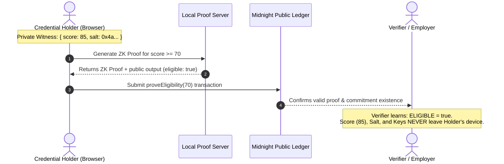

# UmbraCred

[](https://github.com/Khanh-09/umbracred/actions/workflows/ci.yaml)
[](https://umbracred-ashy.vercel.app)
[](https://opensource.org/licenses/MIT)
[](https://midnight.network)

> 🚀 **Live Demo DApp**: [https://umbracred-ashy.vercel.app](https://umbracred-ashy.vercel.app)  
> 🔗 **GitHub Repository**: [https://github.com/Khanh-09/umbracred](https://github.com/Khanh-09/umbracred)

**Confidential Credential Verification on [Midnight](https://midnight.network)**. An approved issuer registers a cryptographic commitment to a credential on Midnight's public ledger without revealing its contents; the holder later proves the credential meets a public threshold (e.g. "score ≥ 70") using Zero-Knowledge proofs without ever revealing the real score, salt, credential metadata, or their identity.

---

## 🌓 Status — Level 3 (First Quarter)

- **Selected Idea**: **Confidential Credentials** ("prove a credential is valid without disclosing it").
- **DApp Architecture**: Full-stack ZK DApp implementing selective disclosure with Compact smart contracts, Midnight.js SDK, DApp Connector API, and React frontend.
- **Contract & Tests**: 6 unit tests passing (`vitest`), covering issuance, authorization checks, eligibility proofs, boundary conditions (`score == threshold`), and multi-holder issuance.
- **CI/CD Pipeline**: GitHub Actions CI workflow configured at [`.github/workflows/ci.yaml`](.github/workflows/ci.yaml) running Compact compilation, TypeScript typechecks, linters, contract test suites, and bundle builds on every push.
- **Privacy Model**: Rigorously defined disclosure boundaries with `disclose()` preventing data leakage beyond the boolean verification outcome.

---

## 📜 Product Proposal: Confidential Credentials

### 1. Executive Summary
Modern identity and verification workflows force users into an all-or-nothing trade-off: to prove compliance or eligibility (e.g., job qualification, course prerequisites, credit thresholds), users must hand over complete documents containing sensitive personal and historical data. **UmbraCred** solves this using Midnight's Zero-Knowledge Compact framework, enabling holders to prove they meet specific requirements without exposing underlying credentials.

### 2. Problem Statement
- **Over-disclosure**: Job applicants, students, and freelancers frequently submit full transcripts, credit reports, and certifications, leaking unnecessary private data.
- **Data Liability**: Organizations collecting and storing raw documents face severe GDPR/compliance liabilities and breach risks.
- **Verification Bottlenecks**: Centralized verifications require manual review or direct third-party API queries that compromise privacy and introduce single points of failure.

### 3. The Midnight Solution
UmbraCred uses Midnight's dual-state ledger (public on-chain state + private client-side witness) to establish a trustless verification layer:
1. **Issuer Commitment**: An accredited issuer calculates `commitment = hash("umbracred:cred:", ownerKey, salt, score)` off-chain and registers it on-chain with `issueCredential(commitment)`.
2. **Selective Disclosure Proof**: When a verifier asks "is your score ≥ threshold?", the holder runs `proveEligibility(threshold)` inside their local proof server.
3. **On-Chain Attestation**: Midnight validates the ZK proof and confirms on-chain that the holder possesses a valid, issuer-approved credential matching the commitment that meets the threshold, returning only `true` or `false`.

### 4. Target Use Cases
- **Gated Hiring & Freelancing Platforms**: Prove skill level or certificate bar without leaking identity or full test results during early screening.
- **Academic & Professional Prerequisites**: Prove course completion or passing grades without disclosing full academic transcripts.
- **Private Compliance & Accreditation**: Prove regulatory or training compliance across organizations without leaking proprietary internal scores.

---

## 🛡️ Privacy Model

UmbraCred enforces mathematically verifiable privacy boundaries:

### What an Outside Observer / Verifier CAN Learn:
- **Issuer Identity**: The public key `issuerKey` of the approved authority that issued credentials.
- **Commitment Existence**: That a 32-byte hash `commitment` is registered on the ledger.
- **Proof Validity**: That the zero-knowledge proof mathematically adheres to the verification circuit.
- **Boolean Outcome**: The single boolean value (`eligible: true/false`) explicitly permitted by `disclose(cred.score >= threshold)`.

### What an Observer CANNOT Learn (Strictly Private):
- **Actual Credential Score**: The holder's exact score (e.g. `85` vs threshold `70`) never leaves the holder's local circuit.
- **Commitment Salt**: The 32-byte cryptographic nonce preventing brute-force dictionary attacks remains local.
- **Holder Identity & Secret Keys**: `ownerSecretKey` is kept isolated in local storage / memory.
- **Issuer Secret Key**: `issuerSecretKey` is kept confidential by the issuing authority.



---

## 🧪 Automated Test Suite

The contract test suite verifies core business logic and ZK constraints. Run tests via:

```bash
cd umbracred-app/contract
npm test
```

### Test Coverage Summary:
| Test Case | Description | Result |
|---|---|:---:|
| `registers credential commitment` | Approved issuer registers valid commitment on-chain | ✅ Pass |
| `rejects non-approved issuer` | Asserts unauthorized accounts cannot issue credentials | ✅ Pass |
| `proves eligibility (passing)` | Holder with score 80 proves eligibility for threshold 70 | ✅ Pass |
| `fails eligibility (below threshold)` | Holder with score 50 correctly returns `false` for threshold 70 | ✅ Pass |
| `fails non-issued credential` | Holder cannot forge proofs for commitments not on ledger | ✅ Pass |
| `exact boundary test` | Score equal to threshold (`score == 70`) returns `true` | ✅ Pass |
| `multi-credential issuance` | Single issuer successfully issues to distinct holders | ✅ Pass |

---

## ⚙️ Setup & Running Locally

Midnight's toolchain runs on Linux/macOS or Windows via **WSL2**:

```powershell
wsl --install          # installs WSL2 + Ubuntu (if needed)
```

Inside WSL2 Ubuntu or Linux/macOS:

```bash
# 1. Compact compiler (0.31.0)
curl --proto '=https' --tlsv1.2 -LsSf https://github.com/midnightntwrk/compact/releases/latest/download/compact-installer.sh | sh
source ~/.bashrc
compact update
compact --version

# 2. Node.js (v22 / v24)
curl -o- https://raw.githubusercontent.com/nvm-sh/nvm/v0.40.1/install.sh | bash
nvm install 22
nvm use 22

# 3. Docker proof server
docker run -d -p 6300:6300 midnightntwrk/proof-server:latest midnight-proof-server -v

# 4. Install dependencies & build contract
cd umbracred-app
npm install --legacy-peer-deps
cd contract && npm run compact && npm test
cd ..

# 5. Start the frontend application
cd bboard-ui
npm run dev
```

The frontend will run at `http://localhost:5173`. Connect using the [Midnight Lace Wallet Extension](https://midnight.network).

---

## 🔬 Public Ledger State vs. Private Witness

| Ledger state (public, on-chain) | Private witness (never leaves the holder's machine) |
|---|---|
| `issuerKey: Bytes<32>` — public key of the approved issuer | `localIssuerSecretKey()` — issuer's secret key |
| `credentials: Set<Bytes<32>>` — commitments to issued credentials | `localCredential()` — the actual `Credential { score, salt }` |
| | `localOwnerSecretKey()` — holder's secret key |

---

## 🧩 `disclose()` Mechanics

- `issueCredential(commitment)` calls `credentials.insert(disclose(commitment))`. The issuer explicitly discloses the commitment hash (an opaque value) so it can be looked up later — never the credential contents it hides.
- `proveEligibility(threshold)` calls `return disclose(cred.score >= threshold)`. Only the **boolean result** of the comparison is disclosed. The real `cred.score` is read from a witness, compared locally inside the circuit, and never leaves the proof as a value.
- `credentials.member(disclose(commitment))` also requires an explicit `disclose()`: any argument passed into a ledger container operation (`Set.member`, `Map.lookup`) counts as a disclosure boundary in Compact.

---

## 🚀 Deployment & Continuous Integration

- **CI/CD Pipeline**: [`.github/workflows/ci.yaml`](.github/workflows/ci.yaml) automatically validates every push.
- **Standalone Local Demo**: Fully functional with local standalone node & proof server.
- **Preprod Testnet Attempt Log**: Full transaction evidence, wallet sync diagnosis, and forum status references recorded in [`DEPLOYMENT_ATTEMPT.md`](DEPLOYMENT_ATTEMPT.md).
